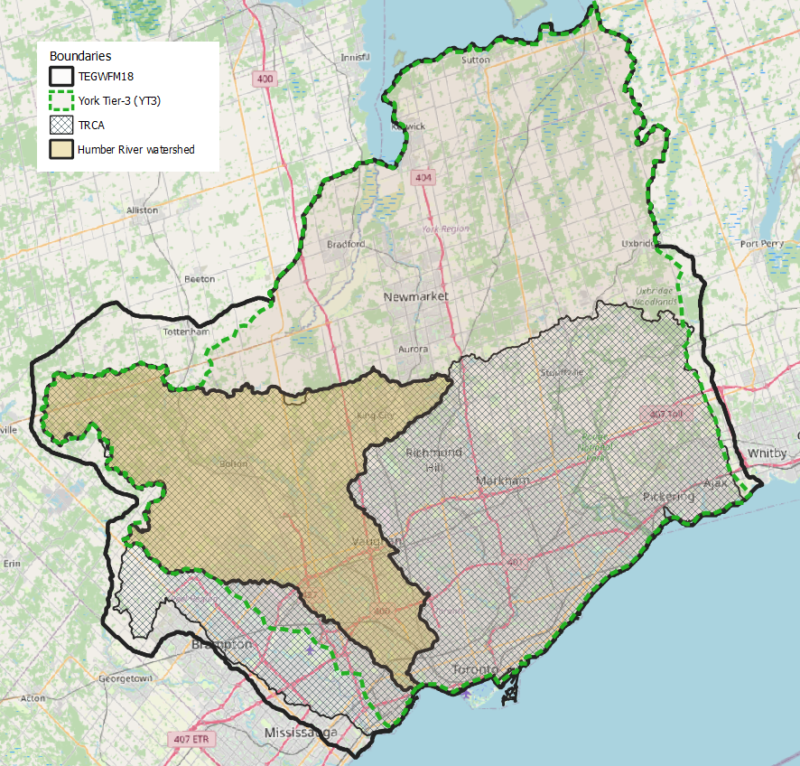
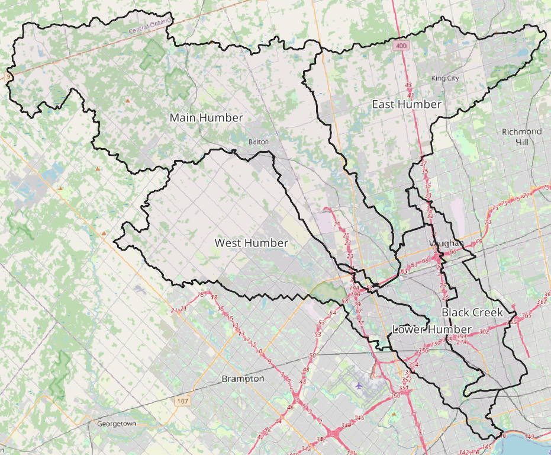
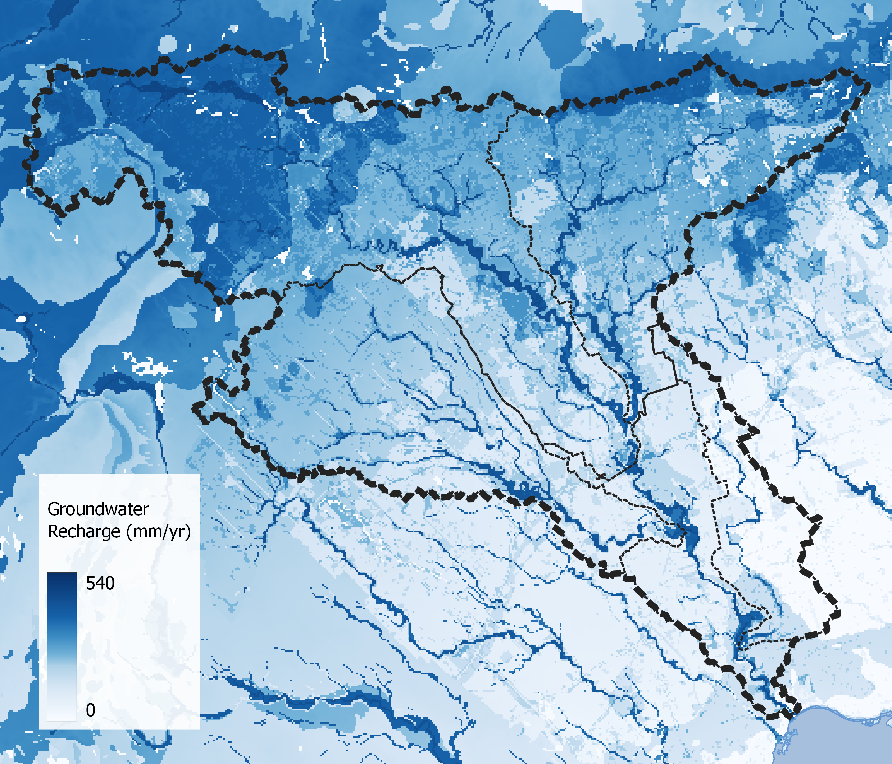
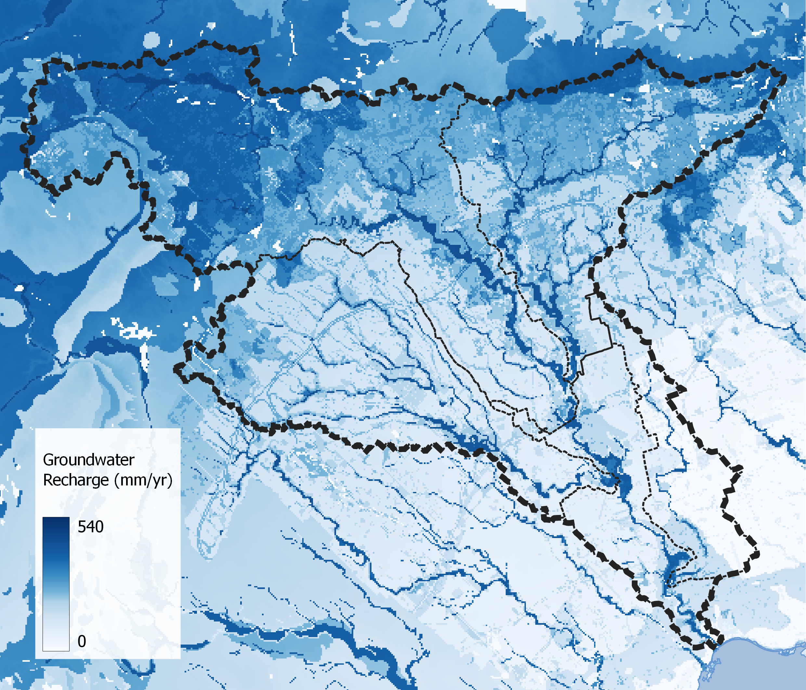
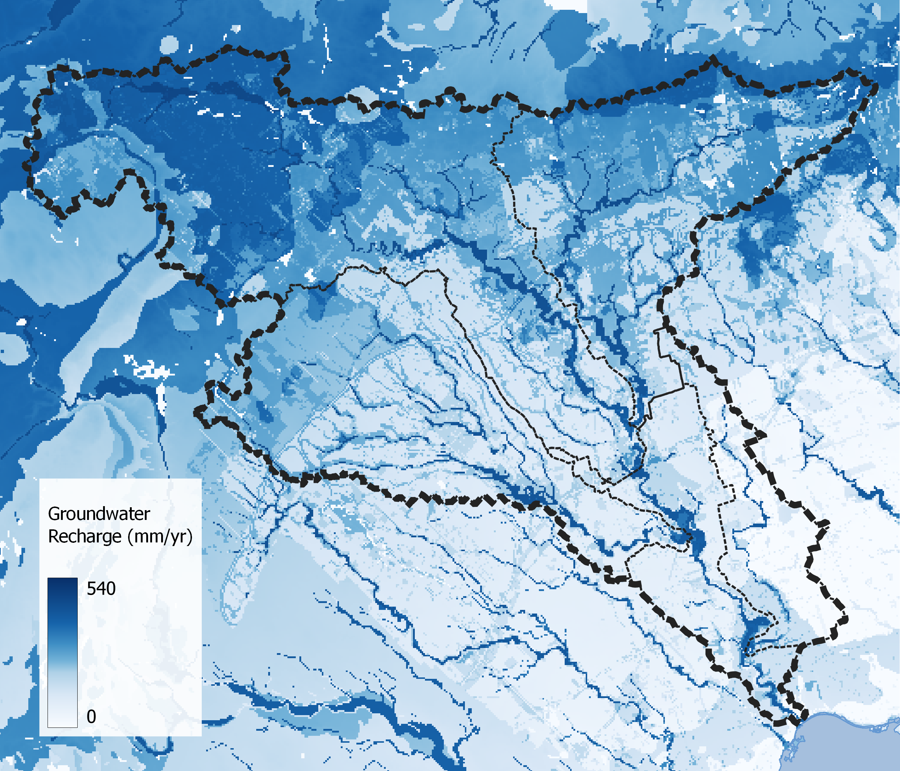
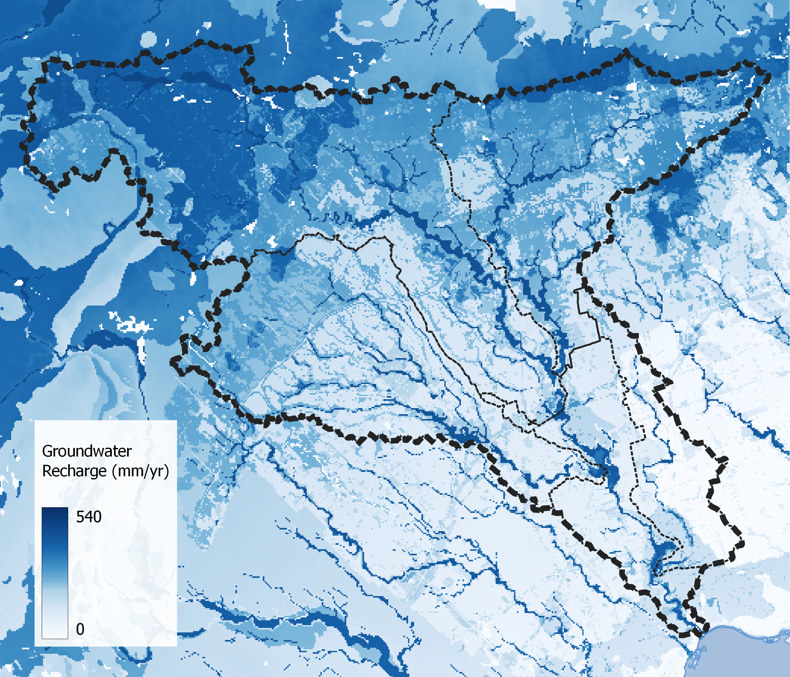

```{r setup, include=FALSE}
knitr::opts_chunk$set(echo = TRUE)
library(knitr)
library(readxl)
library(dplyr)
library(kableExtra)
```


<br><br>

# Introduction

The York Tier-3 (YT3) steady state groundwater flow model (Earthfx Inc., 2013) is
employed to simulate groundwater/surface water interactions within the
Humber River watershed given three scenarios of future land use planning.
The scenarios are compared to a baseline/current (2020) land use plan.
For each scenario, the distribution of groundwater recharge has been
estimated using a raster regression analysis.

The land use distribution scenarios (including the current/baseline condition) provided by the TRCA are as follows:

> **Scenario 1:** Watershed conditions where there is potential future urban expansion into the
whitebelt areas and minimum to no enhancements to natural cover, urban forest canopy, and
stormwater management. The potential future urbanization
of whitebelt lands results in loss of rural and natural lands.

> **Scenario 2:** Watershed conditions where potential future urban development occurs
within areas approved in Official Plans (single-tier, Regional, and lower tier) and through other
planning processes (e.g., Peel New Urban Area). This does not include urbanization of the entire
whitebelt area. This scenario also adds Official Plan based enhancements to natural cover, urban
forest canopy, and stormwater management based on
opportunities on the landscape such as adding width to existing natural corridors while still
retaining developable areas.

> **Scenario 3:** watershed conditions where the level of development is the same as Scenario
2 but adds optimal enhancements to natural cover, urban forest canopy, and stormwater
management. The watershed refined enhanced NHS was
delineated for this scenario based on watershed-level refinements of TRCA’s regional target NHS
that focuses on priority areas for terrestrial and aquatic ecology and the hydrological connections
among them.


The analysis presented here has made use of the expanded version of the YT3 model known as the TRCA Expanded Groundwater Flow Model-2018 (TEGWFM18). While the YT3 model in its delivered form
excluded parts of the TRCA jurisdiction, information was provided with the model file delivery package that allowed for model expansion to extend beyond TRCA's jurisdiction such that the boundary conditions for groundwater modelling are more appropriate.


\newline
*Comparison of model boundaries with respect to the Humber River watershed (study area).*

Details of the TEGWFM18 model expansion was discussed in the November 22, 2018 memorandum titled: *TRCA expanded groundwater flow model development*. This memo was adressed to the TRCA.


### Disclaimer 

It is recommended that future investment be made to build a numerical groundwater model with the focused intent of improving the understanding of TRCA's hydrology and hydrogeology. Until such a model is built, it must be re-iterated and understood that: 

1. the model is being applied beyond its initially intended use; 
1. the model is run by a capable modelling practitioner;
1. the results should be considered preliminary in nature that can provide general
insights for watershed planning purposes; and
1. the TRCA Expanded Groundwater Flow Model-2018 (TEGWFM18) is capable of delivering actionable results.


# Groundwater Recharge

Recharge estimates within all expanded regions (i.e. those areas not covered by the YT3 Model) were unavailable in the original model file delivery and therefore must be estimated. Rates of groundwater recharge are an input
to groundwater models, and the various scenarios that are tested are done so by comparing recharge estimates according to the proposed land use distribution, while all other conditions (climate, precipitation, groundwater pumping, etc.) remain the same.

Under these conditions, groundwater recharge is dependent on three factors: land use, percolation rates and local topography. These factors, along with spatial coordinates to provide some sense of locality, make up the explanatory variables used in the raster regression analysis.


Four (3 scenario + 1 baseline) land use maps have been provided, each with varying distributions of three land use types: Natural, Rural and Urban cover. These land use class distributions have been provided by the TRCA. Within the entire TRCA jurisdiction, recharge has been adjusted to reflect the change in land use and its effect on groundwater recharge rates. The entire TRCA jurisdiction is included because it is likely that land use change outside the Humber River watershed can still have an impact via "cross-boundary" groundwater exchange. This approach differes from previouse watershed modelling performed in the Carruthers (2018) and the Etobicoke (2021) watersheds.

Once the land use was established for each scenario, groundwater recharge estimates, based on an extrapolation from the original YT3 recharge, were determined. More information on recharge estimates, including model validation, have been outlined in the report: [*Update to Recharge Extrapolation Prepared for the TRCA* (Sept, 2023)](https://owrc.github.io/projects/2023/230822-trca-sgra-recharge/).

For each scenario, the recharge estimation was input to the numerical model and the model was run to obtain estimates of discharge to streams and wetlands. Stream and wetland boundary conditions are both applied using sink-only head-dependent flux boundaries. This boundary condition effectively
provides, as a model output, an estimate of the steady state, long term
average, rate of groundwater discharge to the streams and wetlands.

Numerical model parameters, such as stream and wetland boundary conductance terms (i.e., the ability for
water to exchange with the groundwater system), geological layer
geometries and thicknesses, hydraulic conductivities, etc., were
maintained in their original delivered form as provided in the original YT3 model it was calibrated (2013). These parameters were then extended to the expansion area as outlined in TEGWFM18 model expansion memo (November 22, 2018).


# Results

The steady state groundwater discharge to streams is accumulated across
the Humber River watershed. The model provides an estimate of the
long-term average groundwater discharge to streams and wetlands
under current climatic conditions. 

The total cumulative discharge from the model is averaged over the Humber River watershed
(an area of 903km²) to yield estimates in millimetres per year (mm/yr) comparable with typical water budget components, such as annual precipitation (~900mm/yr).

The raster regression analysis and the TEGWFM18 results return an estimate of the expected change in groundwater recharge and groundwater discharge under each scenario, respectively.

```{r fulltable, echo=FALSE, results='asis'}
df <- read_excel("sup/tables.xlsx", sheet = "full")
df$`Change in recharge from baseline` <- scales::percent(df$`Change in recharge from baseline`, accuracy=.1)
df$`Change in discharge from baseline` <- scales::percent(df$`Change in discharge from baseline`, accuracy=.1)
kable(df, caption = "Summary of groundwater exchange over the entire Humber watershed.")  %>%
kable_styling(full_width = T)
```

Rates of change in groundwater discharge correlate well with
recharge (Table 1); changes in discharge are proportional to changes in recharge. Interestingly, in all cases, recharge is roughly 6% (13-15 mm/yr) greater than discharge, suggesting that the Humber watershed loses water to neighbouring watershed via cross-boundary groundwater flow.

This table has also been produced to the 5 Humber sub-watersheds (Main Humber, Black Creek, Lower Humber, East Humber and West Humber) and is provided as an appendix below.

Overall, the Humber River watershed is quite resistant to changes in land use, seeing less than a 5% change in groundwater recharge---a change expected to be within model error. There are large discrepancies however when the water balances are summed over the five sub-watershed. For instance, it is apparent that the West Humber watershed (Table 6) exhibits greater impacts to groundwater exchange (recharge and discharge) where fluxes are estimated to change up to 10%. This should be expected as this sub-watershed seems to experience the greatest change in land use patterns. Simialar conclusions can be made with the East Humber sub-watershed, only to a lesser degree.


\newpage

# Data files

Model output rasters of groundwater recharge and groundwater discharge [can be accessed here](https://www.dropbox.com/scl/fi/wsdlmcrz502lptxswqrhk/231220-HRWP-TEGWFM18-outputs.7z?rlkey=u2zxskdmhc4o9ew4e6oz29hbb&dl=1). Included are 2 sets of 4 rasters: 

1. Long-term averages groundwater recharge (mm/yr) built using raster regression analysis
 - TEGWFM18_regressed_recharge.bil: current conditions groundwater recharge (mm/yr)
 - Sce1_20230828-general-recharge.bil: scenario 1 groundwater recharge (mm/yr)
 - Sce2_20230828-general-recharge.bil: scenario 2 groundwater recharge (mm/yr)
 - Sce3_20230828-general-recharge.bil: scenario 3 groundwater recharge (mm/yr)

2. Steady-state groundwater discharge to streams and wetlands simulated using TEGWFM18*
 - TEGWFM18-Humber-baseline-discharge.bil: current conditions groundwater discharge (m3/d)
 - TEGWFM18-Humber-Sce1-discharge.bil: scenario 1 groundwater discharge (m3/d)
 - TEGWFM18-Humber-Sce2-discharge.bil: scenario 2 groundwater discharge (m3/d)
 - TEGWFM18-Humber-Sce2-discharge.bil: scenario 3 groundwater discharge (m3/d)


> *NOTE: negative values indicates water lost from the groundwater system (gained by streams/wetlands) a.k.a. "groundwater discharge". _All are projected to NAD83 UTM zone 17N._

<br><br>

# References

Earthfx Inc., 2013. Tier 3 Water Budget - Water Quantity Risk Level
Assignment Study Regional Municipality of York Phase 1 Model Development
Report, Feb. 2013.


\newpage

# Subwatershed Waterbalances

Groundwater recharge and groundwater discharge have also been computed on a sub-watershed basis. As evident from the Humber watershed analysis as a whole, there appears to be some cross-boundary groundwater flux. It's entirely possible that the same phenomena occurs among the sub-watersheds. This has not computed here.\newline

\newline
*Location of Humber sub-watersheds.*

Groundwater recharge and discharge simulated for the Main Humber, Black Creek, Lower Humber, East Humber and West Humber sub-watersheds are presented below:\newline

```{r maintable, echo=FALSE, results='asis'}
df <- read_excel("sup/tables.xlsx", sheet = "main")
df$`Change in recharge from baseline` <- scales::percent(df$`Change in recharge from baseline`, accuracy=.1)
df$`Change in discharge from baseline` <- scales::percent(df$`Change in discharge from baseline`, accuracy=.1)
kable(df, caption = "Summary of groundwater exchange over the Main Humber sub-watershed (357km²).")  %>%
kable_styling(full_width = T)
```

```{r blacktable, echo=FALSE, results='asis'}
df <- read_excel("sup/tables.xlsx", sheet = "black")
df$`Change in recharge from baseline` <- scales::percent(df$`Change in recharge from baseline`, accuracy=.1)
df$`Change in discharge from baseline` <- scales::percent(df$`Change in discharge from baseline`, accuracy=.1)
kable(df, caption = "Summary of groundwater exchange over the Black Creek sub-watershed (63km²).")  %>%
kable_styling(full_width = T)
```

```{r lowertable, echo=FALSE, results='asis'}
df <- read_excel("sup/tables.xlsx", sheet = "lower")
df$`Change in recharge from baseline` <- scales::percent(df$`Change in recharge from baseline`, accuracy=.1)
df$`Change in discharge from baseline` <- scales::percent(df$`Change in discharge from baseline`, accuracy=.1)
kable(df, caption = "Summary of groundwater exchange over the Lower Humber sub-watershed (83km²).")  %>%
kable_styling(full_width = T)
```

```{r easttable, echo=FALSE, results='asis'}
df <- read_excel("sup/tables.xlsx", sheet = "east")
df$`Change in recharge from baseline` <- scales::percent(df$`Change in recharge from baseline`, accuracy=.1)
df$`Change in discharge from baseline` <- scales::percent(df$`Change in discharge from baseline`, accuracy=.1)
kable(df, caption = "Summary of groundwater exchange over the East Humber sub-watershed (196km²).")  %>%
kable_styling(full_width = T)
```

```{r westtable, echo=FALSE, results='asis'}
df <- read_excel("sup/tables.xlsx", sheet = "west")
df$`Change in recharge from baseline` <- scales::percent(df$`Change in recharge from baseline`, accuracy=.1)
df$`Change in discharge from baseline` <- scales::percent(df$`Change in discharge from baseline`, accuracy=.1)
kable(df, caption = "Summary of groundwater exchange over the West Humber sub-watershed (204km²).")  %>%
kable_styling(full_width = T)
```


\newpage


# Maps

Below is a set of maps illustrating the distribution of scenario land use followed by the groundwater recharge fields produced using the raster regression analysis technique. All of these layers are provided with this document in standard raster format projected to *NAD83 UTM zone 17N (EPSG:25917)*.

\newline
*Current conditions land use.*

\newline
*Scenario 1 land use.*

\newline
*Scenario 2 land use.*

\newline
*Scenario 3 land use.*

\newline
*Current conditions groundwater recharge (mm/yr).*

\newline
*Scenario 1 groundwater recharge (mm/yr).*

\newline
*Scenario 2 groundwater recharge (mm/yr).*

\newline
*Scenario 3 groundwater recharge (mm/yr).*