<style type="text/css">
  .table25 {width: 25%;}
  .table50 {width: 50%;}
  .table75 {width: 75%;}
</style>

```{r setup, include=FALSE}
knitr::opts_chunk$set(echo = TRUE)
library(dplyr)
library(tidyr)
# library(lubridate)
# library(mgcv)
library(ggplot2)
library(ggrepel)
library(leaflet)
library(sf)
# library(leaflet.extras)
library(readxl)
library(knitr)
library(stringr)
library(kableExtra)

options(knitr.table.format = "latex")
knitr::opts_chunk$set(fig.pos = "H", out.extra = "")
```

```{r main.load, include=FALSE}
df <- read.csv("O:/MadRiver23/02-goHECHMS/HEC-HMS_subbasins.csv")
```


# Introduction

## Upper Mad River

The Nottawasaga Valley Conservation Authority (NVCA) and The Oak Ridges Moraine Groundwater Program (ORMGP) have partnered to explore the applicability of the [__ORMGP's historical climate data service__](https://owrc.github.io/interpolants/modelling/waterbudget/data.html) in supporting event-based HEC-HMS models built in Southern Ontario to investigate the rainfall-runoff response to extreme summer rainfall events. As a proof of concept, the ~246km² Upper Mad River watershed was identified as a good first candidate.

<br>

```{r basemap, echo=FALSE, message=FALSE, warning=FALSE, fig.cap = "Upper Mad River watershed and the Water Survey of Canada (WSC) gauge targeted for HEC-HMS calibration"}
source("basemap.R", local = TRUE)$value
```

<br>

## HEC-HMS

The HEC-HMS model development proceeded in a manner such that planned future long-term continuous simulations could be readily accommodated. As such, the NVCA requested a "Deficit and Constant" method suitable for long term continuous modelling be included with the delivered model. The HEC-HMS model code offered by the [US Army Corps of Engineers Hydrologic Engineering Center](https://www.hec.usace.army.mil/software/hec-hms/) includes such functionality. Many other model codes investigated for this study (including [PRMS](https://www.usgs.gov/software/precipitation-runoff-modeling-system-prms), [Raven](http://raven.uwaterloo.ca/), [MikeSHE](https://www.mikepoweredbydhi.com/products/mike-she), [HydroGeoSphere](https://www.aquanty.com/hydrogeosphere), etc.), also incorporate this functionality, yet HEC-HMS was ultimately chosen due to the code:

1. being free of cost;
1. having an integrated Graphical User Interface (GUI);
1. having both event and continuous/deficit and constant modelling capabilities;
1. has powerful capabilities such as the [2D shallow water flow module included in HEC-RAS](https://www.hec.usace.army.mil/confluence/rasdocs/r2dum/latest/introduction/hec-ras-2d-modeling-advantages-capabilities).
1. being widely used both professionally and academically, thus making HEC-HMS the right application to be adopted institutionally due to its transferability.

<br>

```{r screenshot, echo=FALSE, message=FALSE, warning=FALSE, out.width="100%", fig.cap="Snapshot of the Mad River HEC-HMS project."}
  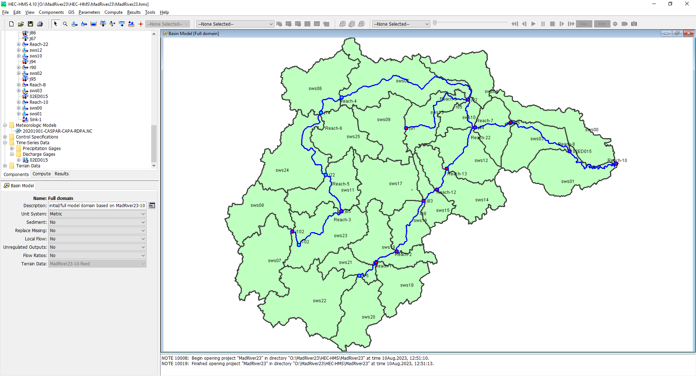
```

<br>


## Design Criteria

The model construction phase proceeded with certain constraints such that the model can readily simulate continuous processes. For instance, the model was built with:

1. smaller (~10km²) subbasins commensurate with sub-watershed boundaries managed by the NVCA that also coincide with the ORMGP climate data service distribution. In total there are 27 HEC-HMS subbasins (see Figure \@ref(fig:leaflet)).
1. subbasins and reaches using HEC-HMS's "GIS" functionality based on a 10m DEM.
1. applied map-based hydrologic processes (i.e., SCS curve method) that is best suited for simulating future land use change.


It's important to note that in practice, models are developed to be either event-based (e.g., individual extreme rainfall events) or continuous (e.g., long-term/seasonal hydrology, climate change, etc.) but rarely both. The ORMGP maintains a near-real-time daily data set complete since 1901, that was built to support long term continuous modelling needed for groundwater resource management. However, the ORMGP also maintains a 6-hour, near-real-time climate data set since 2002. Both of these products are complete and are [spatially distributed to thousands of ~10km² sub-watersheds covering the ORMGP jurisdiction](https://owrc.github.io/interpolants/modelling/waterbudget/data.html).


This has been prepared to satisfy the agreement between NVCA and ORMGP with respect to the Mad River Modelling study. Specifically, it satisfies Task 1.4 (assist the NVCA with preparation of HEC-HMS Technical Memo). To meet this task, this document includes the methods used to i) compile the necessary data (Task 1.1); ii) build the model (Task 1.2); and iii) calibrate/verify the model and conduct a sensitivity analysis (Task 1.3).

<br>

```{r leaflet, echo=FALSE, message=FALSE, warning=FALSE, fig.cap="Mad River HEC-HMS subbasins (click on basins to see properties)"}
subbasins <- st_transform(st_read("O:/MadRiver23/HEC-HMS/MadRiver23/maps/HEC-HMS_subbasins.shp", quiet=TRUE), 4326)

leaflet(subbasins) %>%
  addTiles() %>%
  
  addPolygons(color = "#444444", weight = 1, smoothFactor = 0.5,
              opacity = 1.0, fillOpacity = 0.25,
              fillColor = "lightgreen",
              label = ~paste0("Subbasin ",swsid),
              popup = ~paste0('<b>Subbasin ', swsid,"</b>",
                              '<br>drains to subbasin ', dssws,
                              '<br>(composite) CN: ', round(CN,0),
                              '<br>pecent Imperv: ', round(perimp*100,0),"&#37",
                              '<br>pecent Cover: ', round(percov*100,0),"&#37",
                              '<br>subbasin area: ', round(area,1), "km²",
                              '<br>reach length: ', round(fplen.km,1), "km"
                              ),
              highlightOptions = highlightOptions(
                opacity = 1, fillOpacity =.65, weight = 5, sendToBack = FALSE
              )
  )
```

_* interactive maps are only when [viewed as a webpage](https://owrc.github.io/projects/2023/MadRiver23/)._

<br>

# Data Collection

The Data Collection piece (Task 1.1) relied upon the incorperation of the ORMGP climate data service. Each of the HEC-HMS subbasins mapped well to the ORMGP's sub-watershed delineation. Rainfall accumulations was nonetheless derived from the ~10km² [CaPA-RDPA](https://weather.gc.ca/grib/grib2_RDPA_ps10km_e.html) grid shown below.  Compared with meteorological stations, the CaPA-RDPA product offers a finer spatial distribution of precipitation amounts. Given that southern Ontario extreme summer events are typically of the convective type (Klaassen, 2014), many of these storms are small in scale and are susceptible of being unobserved by southern Ontario's relatively coarse meteorological station network.

<br>

```{r capagrid, echo=FALSE, message=FALSE, warning=FALSE, out.width="100%", fig.cap="HEC-HMS subbasins vs. CaPA-RDPA resolution vs Nearest Active hourly climate stations."}
  knitr::include_graphics('img/capagrid.png')
```

<br>

## Meteorological Data


For the study, meteorological data (i.e., precipitation, snow, temperature, radiation) from three local active meteorological stations having hourly precipitation data (click on a station below to view ORMGP's *sHydrology* data analysis suite) are analyzed. Note that these stations only date back to approximately 2000, so longer term trends (greater than about 25 years) cannot be evaluated using these local stations. 

1. [**6111792: COLLINGWOOD**](https://owrc.shinyapps.io/sHyMet/?sID=148613)
1. [**6117700: BARRIE-ORO**](https://owrc.shinyapps.io/sHyMet/?sID=697655275)
1. [**611E001: EGBERT CS**](https://owrc.shinyapps.io/sHyMet/?sID=360000028)


There is no general trend to annual precipitation in the region. For instance, Collingwood shows a increasing trend of annual precipitation volumes over the since 1997 (Figure \@ref(fig:6111792-annual-precip-trend)), whereas a decreasing trend is found at Egbert CS and no trend is identified at Barrie-Oro (graphs for Egbert and Barrie-Oro not shown here but are readily available by clicking on above links). Trends are assessed both visually and quantitatively using the Mann-Kendall test for trend (p<0.05) using annual precipitation accumulations in years that have complete data.

<br>

```{r 6111792-annual-precip-trend, echo=FALSE, message=FALSE, warning=FALSE, out.width="85%", fig.cap="Annual precipitation. Red outlines signify years that do not pass the [WMO 3/5 rule](https://climate.weather.gc.ca/glossary\\_e.html\\#wmo\\_standards)."}
  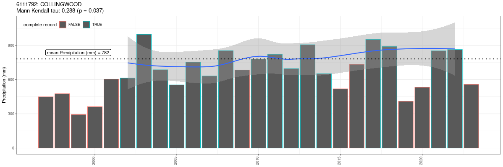
```

<br>

From 2000, mean annual snowpack depths, as shown at Egbert CS (Figure \@ref(fig:6111792-annual-snowpack-trend)), appear to be on the decline. (Note: Mann-Kendall test for trend was not applied as snowpacks do not persist year-round.)

<br>

```{r 6111792-annual-snowpack-trend, echo=FALSE, message=FALSE, warning=FALSE, out.width="85%", fig.cap="Mean annual snowpack depth (cm). (Snow depth is not monitored at Collingwood)."}
  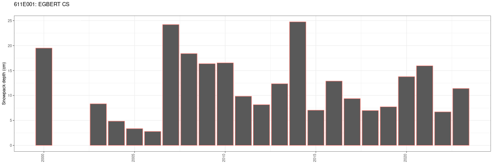
```

<br>

Lastly, air temperatures over the past 25 years at all location stations do not appear to show any trend (Figure \@ref(fig:6111792-annual-meantemp-trend)).

<br>

```{r 6111792-annual-meantemp-trend, echo=FALSE, message=FALSE, warning=FALSE, out.width="85%", fig.cap="Departure from mean daily temperature (8°C) at Collingwood."}
  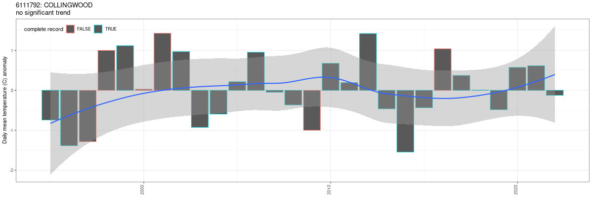
```

<br>

### 24-hour Precipitation Returns

Below shows the frequency analysis performed on the 24-hour accumulations observed at Collingwood (also available form the links above). From 22 years of data (1995-2023), the extrapolated 100-year return 24-hour accumulation looks to be close to range between 110-130 mm, depending on the frequency model applied. Below the Log-Pearson III is shown bounded by the 90% confidence interval.

<br>

```{r 6111792-daily-extreme-precip, echo=FALSE, message=FALSE, warning=FALSE, out.width="85%", fig.cap="Projected 24-hour accumulated precipitation frequency plot for Collingwood."}
  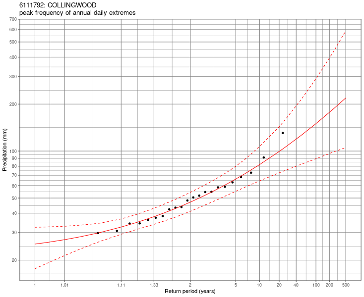
```

<br>


## Streamflow Data

Next, streamflow data are analyzed to characterize large events based on hydrograph, baseflow, and statistical analyses. Instantaneous (5-minute) streamflow records have been acquired since 2011 at [02ED015: MAD RIVER BELOW AVENING](https://wateroffice.ec.gc.ca/report/real\\_time\\_e.html?stn=02ED015). This station is the sole hydrometric station available for model calibration.

### Flow Regime

From the daily historic records at 02EC015 [(hosted here)](https://owrc.shinyapps.io/sHyStreamflow/?sID=149142), it is apparent that there was a change in flow regime that occurred sometime in 2005, where annual runoff yields show a definite increase relative to the pre-2005 period. This can be shown using cumulative discharge plots of both total flow and baseflow (Figure \@ref(fig:02ED015-cumulative)). 

<br>

```{r 02ED015-cumulative, echo=FALSE, message=FALSE, warning=FALSE, out.width="85%", fig.cap="cumulative discharge of both total flow and separated baseflow."}
  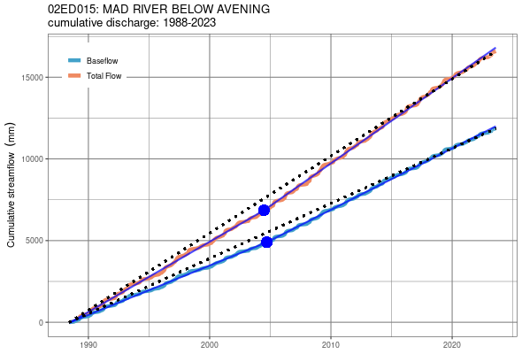
```

<br>

Baseflow was determined as the median of [14 automated hydrograph separation methodologies](https://owrc.github.io/info/hydrographseparation/). The hydrograph in Figure \@ref(fig:02ED015-baseflow) [(also available here)](https://owrc.shinyapps.io/sHyStreamflow/?sID=149142) illustrates the wide range in baseflow estimates (the green ribbon) as well as the median value (blue).

<br>

```{r 02ED015-baseflow, echo=FALSE, message=FALSE, warning=FALSE, out.width="85%", fig.cap="A sample of baseflow separation performed on the Mad River (02ED015) hydrograph."}
  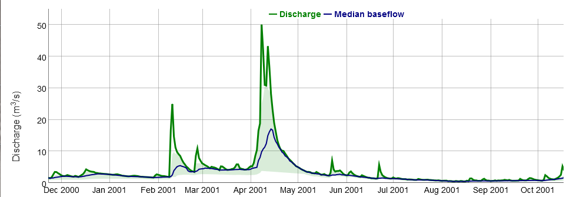
```

<br>

Aggregating baseflow approximations during each calendar month shows significant seasonality in the baseflow regime that is clearly dominated by the spring freshet (Figure \@ref(fig:02ED015-monthly-baseflow)). Consequently, annual extreme discharge tends to occur during the spring months (Figure \@ref(fig:02ED015-extremes-dist)) when water tables are high and snow is melting. This makes for wet antecedent conditions at this time of the year.

<br>

```{r 02ED015-monthly-baseflow, echo=FALSE, message=FALSE, warning=FALSE, out.width="85%", fig.cap="Distributions of monthly baseflow discharge. Notice how March-April-May have significantly greater yields than the rest of the year."}
  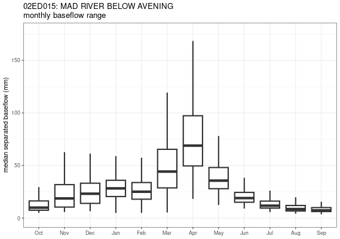
```

<br>


```{r 02ED015-extremes-dist, echo=FALSE, message=FALSE, warning=FALSE, out.width="85%", fig.cap="Distribution of annual extremes shows prevalence for spring occurrence."}
  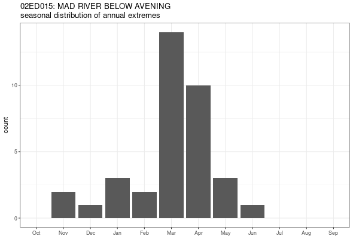
```

<br>


### Peak Flow Events

For model calibration, efforts were made to isolate events that are not caused by snowmelt nor those that occurred during seasonally wet/freshet conditions. This way, the rainfall-runoff relationship can be assessed without any additional influence of wet conditions. Only events occurring from June through September are considered (Figure \@ref(fig:extr-freq), Table \@ref(tab:evnt-table)).  

<br>

```{r extr-freq, echo=FALSE, message=FALSE, warning=FALSE, out.width="75%", fig.cap="Peak flow frequency of summer (Jun-Sep) events only. Calibration and validation events are encircled."}
  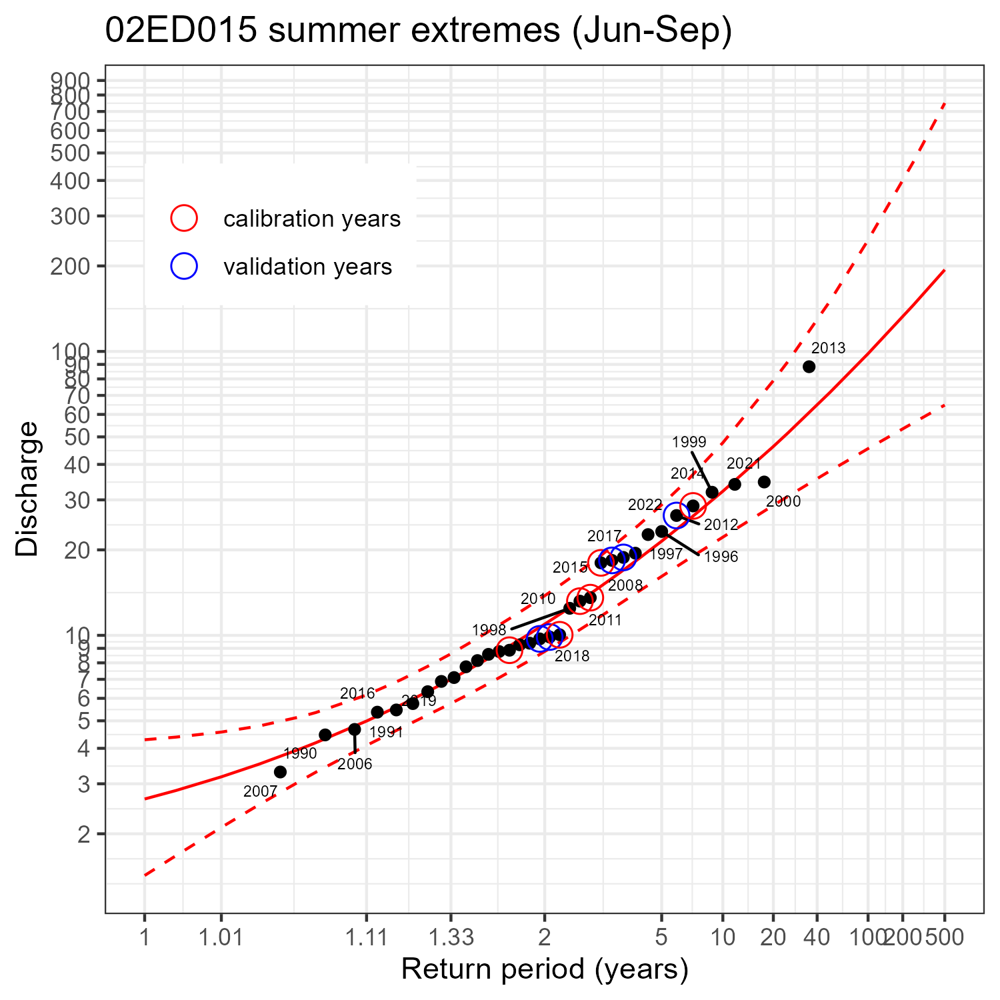
```

<br>

```{r evnt-table, echo=FALSE, message=FALSE, warning=FALSE}
read.csv("E:/Sync/@dev/go/src/ORMGP Modelling/HEC-HMS/event-summary-MadRiver23.csv") %>%
  filter(year!=2013) %>%
  mutate(Date=format(as.Date(dtb),"%b %Y")) %>%
  subset(select=-c(dtb,dte)) %>%
  rename('Rainfall (mm)'='ptot', "Runoff (mm)"='qtot', "Peak Discharge (m³/s)"='qmax', "Initial Discharge (m³/s)"='q0') %>%
  arrange(year) %>%
  subset(select=-year) %>%
  mutate(`Use*`=c('valid.','valid.','valid.','calibr.','calibr.','valid.','calibr.','calibr.','valid.','calibr.','calibr.')) %>%
  relocate(Date) %>%
  relocate(`Use*`, .after = Date) %>%
  kable(caption = 'Extreme flow events selected for modelling to 02ED015.', digits=1, booktabs = T) %>% #, table.attr = "style='width:80%;'") %>%
  footnote(symbol = "calibr.=calibration; valid.=validation")
  # kable_styling(position = "left")
```


The [cumulative discharge plotting](#flow-regime) had identified a clear break in flow regime just before 2005. All calibration storms occur after 2005. It is important for the calibration to remain within this regime as it remains relatively stationary up to present.  


<br>

### Timescale

A comparison of timescales was performed to identify the model time step (Figure \@ref(fig:compare1)). Discharge is available at the 5-minute time step, which is considered close to instantaneous. Below, the instantaneous data are aggregated four ways: 15-minute rolling average, 6-hour rolling average, 24-hour rolling average and the daily mean step function. Discrepancies tend to appear the coarser the time step: daily mean peak discharge tends to be half that of the instantaneous peak discharge during summer events.


<br>

```{r compare1, echo=FALSE, message=FALSE, warning=FALSE, out.width="75%", fig.cap="Comparison of streamflow (m³/s) at different averaging intervals at 02ED015."}
  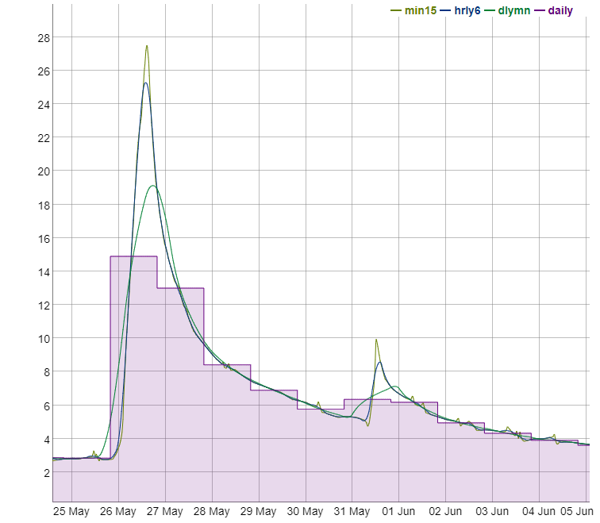
```

<br>


When plotted, the discrepancy between the instantaneous to the 15-minute time step is barely distinguishable. From this, the model time step is set to 15 minutes as it represents the minimum possible scale at which a model could possibly resolve discharge observed at the outlet.


Most importantly, the 6-hourly hydrograph exhibits minor difference from the instantaneous hydrograph for 2 to 10 year events, which is promising as the input climate data set used in this exercise is aggregated to this 6-hourly scale. 


### Recession Coefficient

One necessary HEC-HMS model input parameter is the baseflow coefficient: an exponential law of streamflow recession. The web application hosted by the ORMGP contains an automated recession coefficient calculator, determined by plotting discharge versus the discharge the following day, if and only if the succeeding day's discharge is the lesser of the two. The slope of the plotting a line enveloping the base of this scatter plot defines the recession coefficient (Figure \@ref(fig:recession-coef)).

<br>

```{r recession-coef, echo=FALSE, message=FALSE, warning=FALSE, out.width="75%", fig.cap="Automated recession coefficient estimate (ORMGP, 2023)."}
  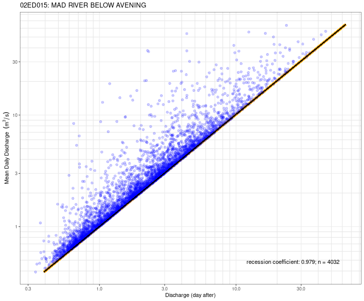
```

<br>

Recession coefficient $k$ is defined as:

$$
  Q_t=kQ_{t-1}
$$

for the Mad River below Avening (02ED015):

$$
  k=0.979
$$

<br>


## Geospatial Data

The HEC-HMS model design is dependent on several digital geospatial data sets including, but not limited to, soils and land use mapping that defines the function of "hydrologic response units" (HRUs). Topography needed delineate appropriate catchment areas, also defines flow lengths and catchment slopes.


### DEM

The digital elevation model (DEM) defines the physical constraints of the HEC-HMS model. It was derived from the [Ontario Digital Elevation Model](https://geohub.lio.gov.on.ca/maps/mnrf::ontario-digital-elevation-model-imagery-derived/about) (OMRF, 2019b), specifically:

  1. SWOOP 2015, package B, and
  1. SCOOP 2013, package A.


<br>

```{r dem-screencapture, echo=FALSE, message=FALSE, warning=FALSE, out.width="100%", fig.cap="Screen capture of the Provincial DEM source."}
  knitr::include_graphics('img/dem-screencapture.png')
```

<br>


The 2m provincial DEM is upscaled to a 10m (horizontal resolution) DEM raster with:

 - a EPSG: 3161 NAD83 Ontario MNR Lambert projection;
 - an upper-left coordinate E:1,300,400; N:11,986,700; and,
 - 2120 rows by 2600 columns (5,512,000 cells)
 - UTM Zone 17N
 - Height reference system: CGVD28
 
Using HEC-HMS's native ["GIS" package](https://www.hec.usace.army.mil/confluence/hmsdocs/hmsguides/gis-tutorials-and-guides), the DEM was used to define subbasins. Some manual alterations were applied to align the subbasins with existing catchment areas employed by the NVCA. 


### Land Use and Surficial Geology

#### Land Use Lookup

The Southern Ontario Land Resource Information System ([SOLRIS v3.0](https://geohub.lio.gov.on.ca/documents/0279f65b82314121b5b5ec93d76bc6ba/about)---OMNR, 2019a) provides a set of land use identifiers. From these, a look-up table is used to assign data-based model parameters such as percent imperviousness and initial abstractions.

<br>

```{r solris-lookup, echo=FALSE, message=FALSE, warning=FALSE}
read.csv("E:/Sync/@gis/Landuse/SOLRIS_3.0/lookup_200731.csv") %>%
  subset(select=-c(ï..Value,ELC.code,Description)) %>%
  mutate(PerImp=PerImp*100,PerCov=PerCov*100) %>%
  rename("Name"="SOLRIS.class.name", "% impervious"="PerImp", "% cover"="PerCov") %>%
  mutate(across('Name', str_replace, '–', '-')) %>%
  kable(caption = 'SOLRIS look-up table', digits=1, booktabs = T) #, table.attr = "style='width:85%;'") %>%
  # kable_styling(position = "left")
```

<br>

The overall makeup of the Mad River watershed is:

<div class="table50">
| SOLRIS (OMNR, 2019a) | Percent coverage |
|:---|---:|
| Undifferentiated | 40% |
| Tilled | 22% |
| Treed Swamp | 16% |
| Deciduous Forest | 8% |
| Mixed Forest | 5% |
| Other | 9% |
</div><br>

#### Percent Imperviousness

```{r basin-imp, echo=FALSE, message=FALSE, warning=FALSE, out.width="85%", fig.cap="Percent imperviousness based on SOLRIS mapping."}
  knitr::include_graphics('img/basin-imp.png')
```

<br>

#### Initial Abstraction

With SOLRIS land use mapping, canopy cover density is distributed to provide first estimates of initial abstraction capacities:

<br>

```{r basin-cov, echo=FALSE, message=FALSE, warning=FALSE, out.width="85%", fig.cap="Relative vegetation cover based on SOLRIS mapping. Darker greens reflect greater cover density."}
  knitr::include_graphics('img/basin-cov.png')
```

<br>


#### Soil Characteristics

Surficial Geology mapping (OGS, 2010) was used to define soil characteristics. The OGS layer is attributed with a set of "relative permeabilities" There are used to map so-called ["Hydrologic Soil Groups"](https://directives.sc.egov.usda.gov/OpenNonWebContent.aspx?content=17757.wba). Using the *"PERMEABILI"* attribute of the OGS (2010) layer, soil groups (A, B, C, D) are mapped to (High, Medium, Low-medium, Low) permeabilities. This was needed to estimate infiltration loss parameters for the Upper Mad River Watershed:

<br>

```{r basin-k, echo=FALSE, message=FALSE, warning=FALSE, out.width="85%", fig.cap="Relative infiltration rates based on OGS (2010). The darker the blue, the less permeable the soil; yellows are the most permeable."}
  knitr::include_graphics('img/basin-k.png')
```

<br>


<div class="table75">
| Relative permeability class | hydrologic soil group | Percent coverage |
|:---|:---:|---:|
| Low permeability | A | 7% |
| Medium-Low | B | 48% |
| High | D | 26% |
| Variable | C | 6% |
| Alluvial | C | 3% |
| Organics | C | 11% |
</div><br>


### Composite Layers

SOLRIS land use (OMNR, 2019a) and OGS surficial geology (2010) are combined to determine SCS Curve Numbers (CN) using standard [SCS lookup tables](https://www.hec.usace.army.mil/confluence/hmsdocs/hmstrm/cn-tables).


#### Curve Number

The SCS Curve Number (CN) is dependent on the land use type and the hydrologic soil group. From standard SCS lookup tables, CNs can be mapped (Figure \@ref(fig:basin-cn)).

<br>

```{r basin-cn, echo=FALSE, message=FALSE, warning=FALSE, out.width="85%", fig.cap="SCS Curve Numbers based on a geospatial overlay of SOLRIS and OGS surficial geology. Darker blue: higher CN."}
  knitr::include_graphics('img/basin-cn.png')
```

<br>


# HEC-HMS Modelling


The Upper Mad River Hydrologic Model is built using [HEC-HMS](https://www.hec.usace.army.mil/software/hec-hms/) (Task 1.2). The HEC-HMS model consists of 27 subbasins, 25 of which drain to the sole hydrometric station at Avening. The HEC-HMS model was designed for event-based analysis. Model design included (USACE, 2000):

- the SCS-CN methodology for runoff generation, 
- th Syder unit hydrograph for basin transfer
- a simple lag function for reach transfer, and 
- a simple recession coefficient baseflow simulator that is activated by a ratio to simulated peak.  


## Climate Zones and Subbasins

Climate zones/subbasins were delineated based on the DEM and were built internally using HEC-HMS's GIS package. Meteorological and streamflow data processing for the Upper Mad River watershed are confined within these bounds (Figure \@ref(fig:basin-compare)).

<br>

```{r basin-compare, echo=FALSE, message=FALSE, warning=FALSE, out.width="85%", fig.cap="Map of HEC-HMS-derived subbasins (blue) compared to the basins provided by the NVCA (red)."}
  knitr::include_graphics('img/basin-compare.png')
```

<br>


## Model Structure

<!-- ```{r tbl.subbsn, echo=FALSE, message=FALSE, warning=FALSE} -->
<!-- kable(df, caption = 'cell-border stripe', table.attr = "style='width:30%;'") -->
<!-- ``` -->


The (sub-)models used in the HEC-HMS design include:

- Loss method: Soil Conservation Service (SCS) curve number;
- Transform method: Snyder unit hydrograph;
- Routing method: simple lag; and
- Baseflow method: simple recession.


## Model Parameters

Some *"free"* parameters are applied uniformly (i.e., globally) across the model. Differences in the water budgeting at each subbasin are then attributed to:

1. land use mapping
1. surficial geology mapping
1. topography (DEM), defining: 
    - subbasin form;
    - channel length; and 
    - channel slope.

> Subbasin parameter assignment can be inspected in the interactive Figure \@ref(fig:leaflet)

Calibration parameters include:

1. SCS Curve Number (CN) method for runoff generation (generated by mapping discussed above)
1. Initial abstraction for rainfall retention (generated by mapping discussed above)
1. Subbasin area and topology (based on DEM topography)
1. $c_t$ Snyder unit hydrograph basin coefficient (global)
1. $c_p$ Snyder unit hydrograph peaking coefficient (global)
1. $k$ baseflow (simple) recession coefficient (global), calculated above
1. $r_p$ ratio to peak flow needed to specify the baseflow regime (global)
1. $lag$ Simple lag for reaches (dependent on reach length)
1. $Q_0$ is the initial discharge, set to the observed discharge at the beginning of the model run
1. $f_{ia}$ a multiplicative factor applied globally to initial abstraction
1. $f_{CN}$ a multiplicative factor applied globally to CN

### Antecedent conditions

With the intention of preparing a model for future long-term continuous simulations in addition to the scope of work presented herein, pre-conditioning every model run according to antecedent conditions is avoided. Rather, once the model moves to a long-term continuous simulation application, the model will rely on so-called "deficit and constant" mechanisms to establish antecedent states, where antecedent moisture conditions are effectively computed. Here, setting initial discharge $(Q_0)$ prior to the model run serves as the sole means of establishing an initial state.


## Event Selection

A total of 11 annual extreme events are selected (Table \@ref(tab:evnt-table)), 6 are used for calibration, 5 for validation. All selected events exceed bankfull discharge (defined  here as events exceeding the 1.5 year return flow). Events are encircled in Figure \@ref(fig:extr-freq).  

Selection of the calibration and validation events were made randomly from the initial 11 events. A twelfth event, occurring in 2013 looks to be a choice event, but for reasons discussed below, this event unfortunately had to be excluded.


## Model Calibration and Verification

The HEC-HMS hydrologic model was calibrated and verified using available streamflow gauge data (Task 1.3). A range of annual extreme events exceeding the 1.5-yr return period are used to simulate the flood flow regime.

The events selected span a wide range of peak discharges for both the calibration and validation exercises. Given that there is a decade's worth of events, it is unlikely that extreme discharges (say greater than a 20-year return) have not been observed and will thus not constrain the model.


### Objective Function

Calibration and validation were optimized both by visual fit and objective function minimization. The objective function targeted is the peak-weighted root mean square error described in USACE (1998):

$$
  Z = \sqrt{\frac{1}{n}\sum^n\left[ \left(q_s-q_o\right)^2\cdot\left(\frac{q_o-\overline{q_o}}{\overline{q_o}}\right)\right]}
$$

where $q_s$, $q_o$ and $\overline{q_o}$ are the simulated, observed and mean-observed discharge respectively.


### Calibration

The model fairs well at matching peak discharge for a wide range of events up to the 10-year return. There are 2 characteristically different hydrographs observed among the calibration set: the 2014, 2018 and 2020 events exhibit a short-duration flashy response, while the 2010, 2011 and 2015 events demonstrate events that appear to have greater storage and lag. This lag may be a sign of wetter antecedent conditions as the initial discharge $Q_0$ tends to be higher compared to the flashy events.

<br>

```{r calib, echo=FALSE, message=FALSE, warning=FALSE, out.width="85%", fig.cap="Calibration performed to 6 annual extreme events."}
  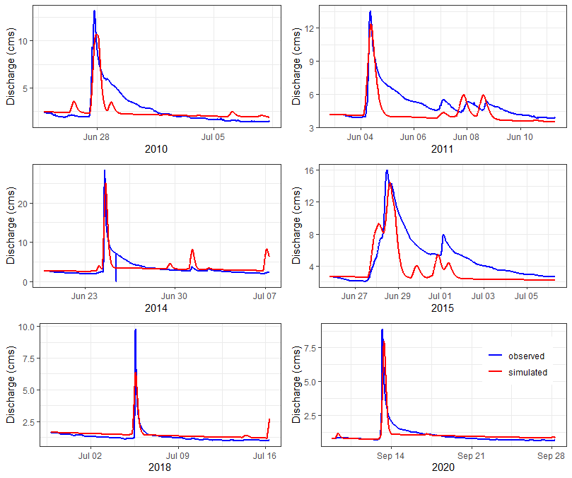
```

<br>


### Verification

The verification events as expected do not perform as well as the calibration set. Overall, 3 of the 5 events (2002, 2008 and 2012) performed well. During the iterative process of calibration and validation, the 2009 and 2017 events were notoriously difficult to simulate, without sacrificing the performance of the calibration set. They are nonetheless included here for the sake of transparency.

<br>

```{r verif, echo=FALSE, message=FALSE, warning=FALSE, out.width="85%", fig.cap="Model varification performed to 5 annual extreme events."}
  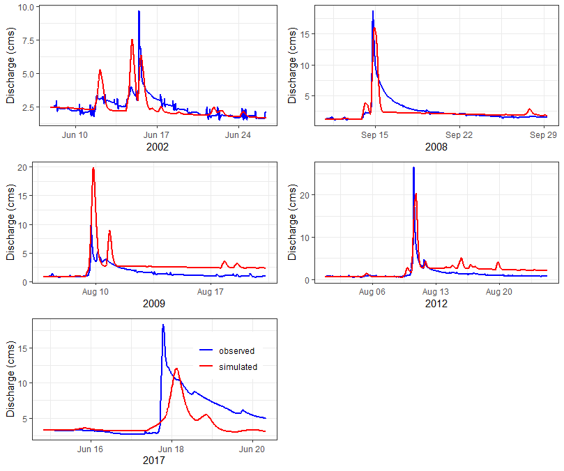
```

<br>


### Sensitivity Analysis

Five parameters ($c_t$, $r_p$, $lag$, $f_{ia}$, and $f_{CN}$) were fed into a Shuffled Complex Evolution (SCE - Duan et.al., 1993) optimization scheme. Subbasin lag coefficient performed best when minimized ($t_p=0$) , indicating that the modelled upper Mad River watershed is quite flashy. (The recession coefficient $k$ was determined from flow records and the Snyder UH peaking coefficient was kept at a constant value $c_p=0.4$.) A global calibration is performed on subsets of 6 The 11 events. Choosing 6 of 11 events yields $_{11}C_6=462$ SCE trials that are optimized and compared in order to assess two crucial issues with numerical model calibration, namely:

1. Parameter inter-dependence: Can the selection of a parameter value be confidently estimated by another parameter, if so, then the dimensionality of the inverse problem is reducible, and
1. Parameter identifiability: Are there optimized parameters that appear to seek a particular/unique value?

Below the results are presented in the form of a correlation matrix. This figure will highlight cross-correlation either visually (lower-left scatter plots) and statistically (upper-right listed coefficient of determinations). Identifiability can be determined visually from the density plots along the diagonal: plots that show greater peakedness (less spread) are deemed most sensitive to change.


<br>

```{r corr-matrix-final, echo=FALSE, message=FALSE, warning=FALSE, out.width="85%", fig.cap="Model parameter correlation matrix built for sensitivity analysis. `zfinal` is the average peak-weighted RMSE minimized by the SCE scheme."}
  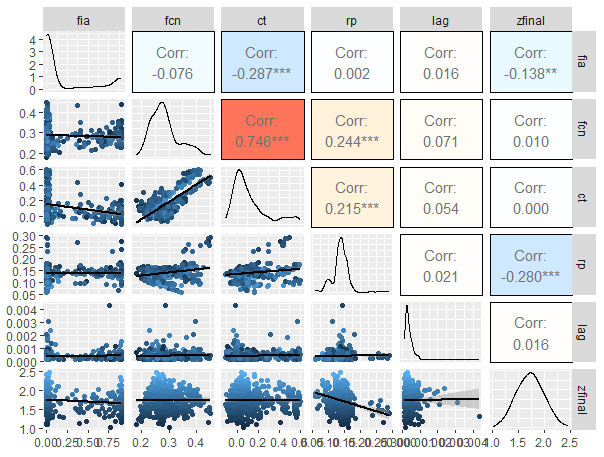
```

<br>

Key takeaways from Figure \@ref(fig:corr-matrix-final):

1. initial abstraction $(i_a)$ and reach $lag$ appear to perform best when minimized---resulting from the flashiness of the selected events;
1. ratio to peak $(r_p)$ appears to be the most identifiable, meaning that its calibrated value has the greatest confidence and that the model is most sensitive to change in $r_p$; and
1. CN values appear to correlate well with the Snyder UH basin coefficient $(c_t)$---meaning that changes to one parameter can be compensated by the other, and thus the model's sensitivity to these parameters would have been overstated should a global sensitivity analysis (as done here) had not been performed.

<br>


## Event Modelling

With the calibrated parameters and the model set, the model is then run through a set of scenarios. Two designed storms, the SCS type II method and the Timmins storm are applied as per NVCA guidelines. In addition, a projected storm under a changing climate is applied. 


### Design Storms

Three forms of synthetic hyetographs are developed to test design events now and under the changing climate. The Timmins Storm is pre-defined while the SCS type II design storms and the climate change projections are constructed using the "alternating block" synthetic hyetographs (NRC-PCS, 2018).

Application of these storms are multiplied by areal reduction factors (as a function of the study area's "circular drainage area"---EWRG, 2017). Here, the Mad River model has an approximate 415 km² circular drainage area.

```{r results-load, include=FALSE}
  df.results.timmins <- read_excel("O:/MadRiver23/HEC-HMS/results/scenarios.xlsx",'Timmins')
  df.results.scsii <- read_excel("O:/MadRiver23/HEC-HMS/results/scenarios.xlsx",'SCSII')
  df.results.CC <- read_excel("O:/MadRiver23/HEC-HMS/results/scenarios.xlsx",'climate change')
```


#### Timmins Storm

A 193 mm, 12-hour storm was recorded in Timmins, Ontario on [August 31, 1961](https://www.canada.ca/en/environment-climate-change/services/water-overview/quantity/floods/events-ontario.html#Section3). With a 415 km² circular drainage area, the Timmins areal reduction factor would be 76%. It's hourly hyetograph is given as (EVA, 2017): 


<div class="table50">
| hour | Acc. Precip. (mm) | Reduced (mm) |
|:---|:---|:---|
| 1 | 15 | 11.4 |
| 2 | 20 | 15.2 |
| 3 | 10 | 7.6 |
| 4 | 3 | 2.28 |
| 5 | 5 | 3.8 |
| 6 | 20 | 15.2 |
| 7 | 43 | 32.68 |
| 8 | 20 | 15.2 |
| 9 | 23 | 17.48 |
| 10 | 13 | 9.88 |
| 11 | 13 | 9.88 |
| 12 | 8 | 6.08 |
</div><br>


#### SCS type II

The 2-, 5-, 10-, 25-, 50-, and 100-year SCS type II 24-hour design storms were re-casted as synthetic hyetographs using the alternate block method. 24-hour rainfall return periods were taken (conservatively) as the maximum posted 24-hour return intensities (mm) of four local meteorological stations with IDF curves: 

<br><div class="table75">
| T (years) | Collingwood | Barrie* | Egbert | Barrie Oro | max |
|:---|:---|:---|:---|:---|:---:|
| 2 | 46.7 | 47.4 | 40.5 | 43.4 | 47.4 |
| 5 | 60.6 | 63.8 | 55.2 | 52.2 | 63.8 |
| 10 | 69.8 | 76.2 | 67.9 | 58.1 | 76.2 |
| 25 | 81.6 | 94.0 | 88.2 | 65.6 | 94.0 |
| 50 | 90.3 | 108.8 | 107.3 | 71.2 | 108.8 |
| 100 | 99.0 | 125.1 | 130.4 | 76.8 | 130.4 |
</div>

_* Barrie is no longer an active station, however an IDF curve is available._

<br>

This produces the hyetographs in Figure \@ref(fig:scsii-rainfall).

<br>

```{r scsii-rainfall, echo=FALSE, message=FALSE, warning=FALSE, out.width="85%", fig.cap="SCS type II 24-hour design storm hyetographs."}
# scsii <- c( # 12-hour
#   0.020400000000000026,0.024949999999999996,0.03149999999999999,0.04018333333333332,
#   0.062425000000000015,0.45719166666666694,0.18298333333333305,0.05876666666666666,
#   0.04042499999999998,0.031925000000000064,0.02624166666666659,0.02300833333333337)
scsii <- c( # 24-hour
  0.009445833333333311, 0.011454166666666654, 0.01246250000000005, 0.01347083333333334, 
  0.014899999999999991, 0.01691666666666669, 0.018933333333333375, 0.02094999999999991, 
  0.026466666666666774, 0.033724999999999956, 0.05248333333333332, 0.384241666666667, 
  0.15361666666666748, 0.04935000000000006, 0.03395833333333338, 0.026858333333333314, 
  0.0219541666666667, 0.019362499999999987, 0.016837499999999953, 0.014395833333333307, 
  0.012766666666666709, 0.012349999999999977, 0.01175416666666671, 0.01134583333333331)
df.scs <- data.frame('hour'=seq(length(scsii)), scsii=scsii) %>%
  mutate('2yr' = scsii*47.4,
         '5yr' = scsii*63.8,
         '10yr' = scsii*76.2,
         '25yr' = scsii*94.0,
         '50yr' = scsii*108.8,
         '100yr' = scsii*130.4) %>%
  subset(select=-scsii) %T>%
  write.csv('scsii.csv', row.names = F) %>%
  gather("return", "precip", -hour) %>%
  mutate(return = factor(return, levels=c('2yr','5yr','10yr','25yr','50yr','100yr')))

df.scs %>% ggplot(aes(hour,precip)) + 
  theme_bw() + theme(legend.position = c(.9,.9), legend.justification = c(1,1)) +
  geom_step(aes(color=return), linewidth=1) +
  labs(title="SCS type II 24-hour design storms", y="rainfall (mm/hr)") +
  scale_colour_viridis_d(direction = -1, end = 0.9) +
  xlim(c(1,24))
```

<br>

#### Results

The Design storms of Timmins and SCS type II 100-year return storms exceed flows ever measured at the Avening gauge (Figures \@ref(fig:timmins-result) and \@ref(fig:scsii-result)).

<br>

```{r timmins-result, echo=FALSE, message=FALSE, warning=FALSE, out.width="85%", fig.cap="Modelled dicharge under the Timmins design storm."}
df.results.timmins %>%
  ggplot() + theme_bw() + geom_line(aes(minute/60,cms), linewidth=1) +
  labs(x="hour",y="discharge (m³/s)",title="Timmins design storm",subtitle="02ED015: Mad River below Avening")
```

<br>

```{r scsii-result, echo=FALSE, message=FALSE, warning=FALSE, out.width="85%", fig.cap="Modelled dicharges under the SCS type II design storms."}
f1 = 8
x0 = 17
df.results.scsii %>%
  ggplot(aes(x=minute/60)) + 
    theme_bw() +
    geom_line(aes(y=`2yr`), linewidth=1) + 
    geom_line(aes(y=`5yr`), linewidth=1) + 
    geom_line(aes(y=`10yr`), linewidth=1) + 
    geom_line(aes(y=`25yr`), linewidth=1) + 
    geom_line(aes(y=`50yr`), linewidth=1) + 
    geom_line(aes(y=`100yr`), linewidth=1) +
    # geom_line(data=df.results.timmins, aes(y=cms))
    annotate('text',x=x0,y=f1+max(df.results.scsii$`2yr`),label="2yr") +
    annotate('text',x=x0,y=f1+max(df.results.scsii$`5yr`),label="5yr") +
    annotate('text',x=x0,y=f1+max(df.results.scsii$`10yr`),label="10yr") +
    annotate('text',x=x0,y=f1+max(df.results.scsii$`25yr`),label="25yr") +
    annotate('text',x=x0,y=f1+max(df.results.scsii$`50yr`),label="50yr") +
    annotate('text',x=x0,y=f1+max(df.results.scsii$`100yr`),label="100yr") +
    labs(x="hour",y="discharge (m³/s)",title="SCS type II 24-hour duration design storms",subtitle="02ED015: Mad River below Avening")
```

<br>

### Climate Change

Climate change scenarios are built using projected IDF curves offered by the [IDF-CC](https://www.idf-cc-uwo.ca/) tool (Simonovic et.al., 2015). Like the SCS method, the alternating block approach is used to convert the IDF curve into a design hyetograph. The IDF-CC design storm is processed as follows:

1. The [IDF-CC](https://www.idf-cc-uwo.ca/) design support tool was used to acquire current and projected Intensity-Duration-Frequency (IDF) curves. From this tool, the [CMIP6](https://esgf-node.llnl.gov/projects/cmip6/) ensemble, downscaled and biased corrected as per [PCIC](https://www.pacificclimate.org/data/statistically-downscaled-climate-scenarios), are packaged into future projected IDF curves.
1. 3 climate change scenarios (RCP 2.4, 4.5 and 8.5) are considered.
1. IDFs produced for the time horizons 2015-2045 and 2045-2100 are compared with current IDF curves, i.e., 3 IDFs per scenario.
1. The 100-year return precipitation events are created using the alternating block approach following the Natural Resources Canada document: *Case studies on climate change in floodplain mapping* (NRC, 2018).

<!-- In total this comes to $3\times 3 \times 1=9$ model runs. -->


#### IDF

IDFs are defined by (Simonovic et.al., 2015):

$$
  i=A\cdot \left(t+t_0\right)^B
$$

where $i$ is rainfall rate (mm/hr), $t$ duration of precipitation event (hr), $A$, $B$ and $t_0$ are coefficients provided by the IDF-CC tool. According to Simonovic et.al. (2015) the IDF parameters for the study area are:

<br><div class="table75">
| T (years) |	Coefficient $A$ |	Coefficient $B$ |	Coefficient $t_0$ |	24-hour event (mm) |
|:---|---:|---:|---:|---:|
| 2  	| 22.1	| -0.755	| 0.070 | 48.0 |
| 5  	| 30.1	| -0.771	| 0.091 | 62.1 |
| 10	| 35.6	| -0.780	| 0.103 | 71.4 |
| 20	| 40.9	| -0.788	| 0.112 | 79.9 |
| 25	| 42.6	| -0.790	| 0.115 | 82.7 |
| 50	| 47.8	| -0.796	| 0.123 | 91.0 |
| 100	| 53.0	| -0.802	| 0.129 | 99.0 |
</div>

<br>


#### Results

Climate change projections see a general increase to return floods: slightly for the near-term (Figure \@ref(fig:cc2015-result)), more pronounced in the long-term (Figure \@ref(fig:cc2045-result)).

<br>

```{r cc2015-result, echo=FALSE, message=FALSE, warning=FALSE, out.width="85%", fig.cap="Projected change in runoff ranging from a 2- to 100-year rainfall events, 2015-2045."}
df.results.CC %>%
  ggplot(aes(x=minute/60)) + 
  theme_bw() + theme(legend.position = c(.9,.9), legend.title = element_blank(), legend.justification = c(1,1)) +
  
  geom_ribbon(aes(ymin=`CC-2015-8.5-2yr`,ymax=`CC-2015-8.5-100yr`,fill='RCP-8.5'),alpha=.5) +
  
  geom_ribbon(aes(ymin=`CC-2015-4.5-2yr`,ymax=`CC-2015-4.5-100yr`,fill='RCP-4.5'),alpha=.5) +
  geom_ribbon(aes(ymin=`CC-2015-2.6-2yr`,ymax=`CC-2015-2.6-100yr`,fill='RCP-2.6'),alpha=.5) +
  
  geom_line(aes(y=`CC-2015-8.5-2yr`), linewidth=.5) +
  geom_line(aes(y=`CC-2015-2.6-2yr`), linewidth=.5) +
  geom_line(aes(y=`CC-2015-4.5-2yr`), linewidth=.5) +
  geom_line(aes(y=`CC-2015-8.5-100yr`), linewidth=.5) +
  geom_line(aes(y=`CC-2015-2.6-100yr`), linewidth=.5) +
  geom_line(aes(y=`CC-2015-4.5-100yr`), linewidth=.5) +
  
  geom_line(aes(y=`current-2yr`, linetype='current'), linewidth=1) +
  geom_line(aes(y=`current-100yr`, linetype='current'), linewidth=1) +
  
  labs(x="hour",y="discharge (m³/s)",title="Projected response, 2015-2045",subtitle="02ED015: Mad River below Avening") +
  scale_linetype_manual(values=c('dotted','dotted')) +
  scale_fill_manual(values=c("red","grey90","grey10")) +
  guides(fill = guide_legend(override.aes = list(alpha = .35)))
```

<br>

```{r cc2045-result, echo=FALSE, message=FALSE, warning=FALSE, out.width="85%", fig.cap="Projected change in runoff from ranging from a 2- to 100-year rainfall events, 2045-2100."}
df.results.CC %>%
  ggplot(aes(x=minute/60)) + 
  theme_bw() + theme(legend.position = c(.9,.9), legend.title = element_blank(), legend.justification = c(1,1)) +
  
  geom_ribbon(aes(ymin=`CC-2045-8.5-2yr`,ymax=`CC-2045-8.5-100yr`,fill='RCP-8.5'),alpha=.5) +
  
  geom_ribbon(aes(ymin=`CC-2045-4.5-2yr`,ymax=`CC-2045-4.5-100yr`,fill='RCP-4.5'),alpha=.5) +
  geom_ribbon(aes(ymin=`CC-2045-2.6-2yr`,ymax=`CC-2045-2.6-100yr`,fill='RCP-2.6'),alpha=.5) +
  
  geom_line(aes(y=`CC-2045-8.5-2yr`), linewidth=.5) +
  geom_line(aes(y=`CC-2045-2.6-2yr`), linewidth=.5) +
  geom_line(aes(y=`CC-2045-4.5-2yr`), linewidth=.5) +
  geom_line(aes(y=`CC-2045-8.5-100yr`), linewidth=.5) +
  geom_line(aes(y=`CC-2045-2.6-100yr`), linewidth=.5) +
  geom_line(aes(y=`CC-2045-4.5-100yr`), linewidth=.5) +
  
  geom_line(aes(y=`current-2yr`, linetype='current'), linewidth=1) +
  geom_line(aes(y=`current-100yr`, linetype='current'), linewidth=1) +
  
  labs(x="hour",y="discharge (m³/s)",title="Projected response, 2045-2100",subtitle="02ED015: Mad River below Avening") +
  scale_linetype_manual(values=c('dotted','dotted')) +
  scale_fill_manual(values=c("red","grey90","grey10")) +
  guides(fill = guide_legend(override.aes = list(alpha = .35)))
```

<br>

```{r cc-table, echo=FALSE, message=FALSE, warning=FALSE}
df.results.CC %>%
  gather("scenario","q",-minute) %>%
  mutate(Tret=stringi::stri_reverse(scenario),
         Tret=str_split(Tret, "-", simplify = T)[,1],
         Tret=stringi::stri_reverse(Tret),
         scenario = substr(scenario,1,nchar(scenario)-nchar(Tret)-1)) %>%
  spread(Tret,q) %>%
  # ggplot(aes(x=minute/60)) +
  #   geom_line(aes(y=`2yr`,color=scenario)) +
  #   geom_line(aes(y=`100yr`,color=scenario))
  group_by(scenario) %>%
  summarise(`2yr`=max(`2yr`),`100yr`=max(`100yr`)) %>%
  mutate(scenario = str_replace(scenario, "CC-2015-", "2015-2045 "),
         scenario = str_replace(scenario, "CC-2045-", "2045-2100 ")) %>%
  kable(caption = 'Climate Change scenario peak flow summary (m³/s)', digits=1, booktabs = T) #, table.attr = "style='width:40%;'") %>%
  # kable_styling(position = "left")
```

<br><br>


## Discussion of Model Limitations


### Omission of the 2013 Storm

The July 8, 2013 storm was a notable event, causing mass power outages and leaving stranded cars and even trains in the GTA. It was also a particularly distinct event observed at the 02ED015 Avening stream flow gauge and would be an obvious target for modelling extreme events. For reasons best described by the plot below, there was a mismatch in data availability preventing model calibration to this event.

<br>

```{r evnt-scatter, echo=FALSE, message=FALSE, warning=FALSE, out.width="85%", fig.cap="Rainfall-runoff magnitudes of 12 recent flood events."}
# read.csv("E:/Sync/@dev/go/src/ORMGP Modelling/HEC-HMS/event-summary-MadRiver23.csv") %>%
#   # filter(year!=2013) %>%
#   ggplot(aes(x=ptot,y=qtot)) +
#     theme_bw() +  theme(legend.position = c(.1,.9), legend.justification = c(0,1)) +
#     geom_point(aes(size=qmax,color=qmax)) +
#     geom_text_repel(aes(label=year)) +
#     scale_color_continuous(limits=c(0, 100), breaks=seq(0, 100, by=20), name="Peak discharge (m³/s)") +
#     scale_size_continuous(limits=c(0, 100), breaks=seq(0, 100, by=20), name="Peak discharge (m³/s)") +
#     guides(color=guide_legend(), size=guide_legend()) +
#     labs(x='Total rainfall (mm)', y="Runoff volume (mm)")

read.csv("E:/Sync/@dev/go/src/ORMGP Modelling/HEC-HMS/event-summary-MadRiver23.csv") %>%
  # filter(year!=2013) %>%
  ggplot(aes(x=ptot,y=qmax)) +
  theme_bw() +  theme(legend.position = c(.1,.9), legend.justification = c(0,1)) +
  geom_point(aes(size=qtot,color=qtot)) +
  geom_text_repel(aes(label=year)) +
  scale_color_continuous(limits=c(0, 20), breaks=seq(0, 20, by=5), name="Runoff volume (mm)") +
  scale_size_continuous(limits=c(0, 20), breaks=seq(0, 20, by=5), name="Runoff volume (mm)") +
  guides(color=guide_legend(), size=guide_legend()) +
  labs(x='Total rainfall (mm)', y="Peak discharge (m³/s)", title="Rainfall-runnoff event summary",subtitle="02ED015: Mad River below Avening")
```

<br>

There is a clear discrepancy between the accumulative rainfall observed and both the peak and cumulative discharge measured at the Mad River gauge. The 2013 storm appears to be highly localized that failed to be registered by either the CaPA-RDPA system or the Environment Canada meteorological station network. Including the storm into the calibration required sacrifice that was too costly to the global calibration; thus the 2013 storm was omitted.

Before doing so, an *hourly* hyetograph obtained from the [Mount Forest (AUT)---6145504](https://climate.weather.gc.ca/climate_data/hourly_data_e.html?StationID=7844&txtStationName=mount+forest) meteorological station was substituted for the *6-hourly* CaPA-RDPA to check whether rainfall intensity factored in the calibration mismatch. This was *not* the case. 

*NOTE: The Mount Forest (AUT) dataset is included with the model file delivery.*


### Flashy System

As evidenced by the tendency for model (calibration) performance to increase with decreased lag times, the modelling exercise suggests that the upper Mad River is a flashy system. Lag times had to be reduced to match the speed of rising limbs.

It is recommended that future modelling of extreme events be performed with monitoring data at or below a 15-minute temporal resolution.


### Initial Abstractions

Along with lag times, sensitivity analysis showed that model calibration could be accomplished quite well assuming initial abstractions can be neglected $(f_{ia}\rightarrow 0)$. This is a consequence of calibrating to flashy systems. However, given that the intent of this study was ta also develop a model with continuous modelling applicability, neglecting $i_a$ is untenable.

Therefore, cover density (Figure \@ref(fig:basin-cov)) was multiplied by a summertime standard leaf-area index $\text{LAI}=5$ to determine $i_a$ for each subbasin. Initial abstraction $(i_a)$ was kept constant and calibration proceeded by adjusting the remaining parameters.


### Baseflow Dependence

There is some indication that the early summer hydrograph form is affected by the state in groundwater levels. The Flashiest of storms tended to occur near the end of the summer season and when initial discharge $(Q_0)$ was relatively low. It appears that the groundwater and hydrological systems should *not* be de-coupled in this system, especially when modelling the spring freshet seasons.


<br>

# Conclusions

A HEC-HMS model of the Mad River has been built to project the runoff response to extreme summer rainfall events occurring upstream of Creemore, Ontario. The model was calibrated using 6 events and verified using 5 additional events to the sole streamflow monitoring gauge: Mad River below Avening (Water Survey of Canada gauge 02ED015).

## Input data sources

In addition to only one monitoring location, input data access was also limited: the nearest active climate station is over 20km away. In southern Ontario, extreme summer events are historically convective in nature (Klaassen, 2014) the kind of storm that typically extend less than 10km. Consequently, any modelling of rainfall events in the study area using station data must rely on spatial extrapolation methods that do nothing but overestimate the likely extent of the rainfall events being modelled.

After demonstrating the distributed climate data service hosted by the ORMGP, the NVCA sought to have a rainfall-runoff model built that relied on the distributed rainfall re-analysis product (i.e., CaPA-RDPA) offered by Environment and Climate Change Canada that is resolved at the scale that best resembles southern Ontario convective storms. The disadvantage of CaPA-RDPA is that it is currently offered at a time step of 6-hour accumulations---too coarse for many rainfall-response modelling applications. 

In part, this modelling exercise was a test of whether model uncertainty can be reduced by improving rainfall distribution at the expense of lowered rainfall intensities. Given the lack of station data for the study area, we were unable to conclude one way or the other; however, the model did succeed at matching peak flows and it was evident that by increasing curve numbers peak flow could easily be overestimated, suggesting that rainfall intensity may not be as critical to modelling upper Mad River events.

## The Role of Groundwater

The flow regime of the upper Mad River is highly seasonal having the highest discharge rates occurring during the spring freshet season. In fact, only one of the events modelled (2013) represented that year's the annual extreme; in all other cases, spring discharge rates exceeded the observed response of the selected storms.  This suggests that from a flood risk perspective, it may be ill-advised to rely solely on summer extreme rainfall events while neglecting the spring freshet flow conditions.

Spring events are not necessarily driven by rainfall intensities experienced in the summertime rather a combination of high water tables present (i.e., wet antecedent conditions) during snowpack melt events. Modelling this phenomenon not only requires the continuous modelling of snowpack formation and ablation, but also requires the explicit representation of the shallow groundwater system's interaction with the ground surface. From this, one may conclude that HEC-HMS, or for that matter any other rainfall-runoff model typically used in this application, is insufficient for the upper Mad River. Rather a physics-based integrated groundwater-surface water model is warranted for spring flows.

The need for an integrated model may be bolstered further by the fact that there exists Karstic features in the northern portions of the model domain. Karst is notorious for having quick response to rainfall events independent of surface drainage pathways.

<br>

## In closing

The HEC-HMS model built here for the Mad River upstream of Creemore has exhausted all available data and has been shown to adequately simulate peak-flow response to storms up to the 10-year return. Limitations implied in this statement is not a function of model capability, but one of data availability. Improvements to this model would be gained by added long-term monitoring.


<br><br>

# References

Duan, Q.Y., V.K. Gupta, and S. Sorooshian, 1993. Shuffled Complex Evolution Approach for Effective and Efficient Global Minimization. Journal of Optimization Theory and Applications 76(3) pp.501-521.

Environmental Water Resources Group, 2017. Technical Guidelines for Flood Hazard Mapping (March, 2017). 137pp.

Klaassen, J., 2014. Ontario Rainfall Climatology. Internal Environment Canada (Meteorological Service of Canada) publication. Prepared in support of the Toronto 2015 Pan Am and Parapan Am Games. Toronto, Ontario.

Natural Resources Canada, Public Safety Canada. 2018. Case studies on climate change in floodplain mapping v.1 ANNEX C: FLOOD MAPPING AND CLIMATE CHANGE: WATERFORD RIVER CASE STUDY ANALYSIS.

Oak Ridges Moraine Groundwater Program (2023). sHydrology stream flow analysis tool [Online image]. https://www.oakridgeswater.ca/

Ontario Geological Survey 2010. Surficial geology of southern Ontario; Ontario Geological Survey, Miscellaneous Release— Data 128 – Revised.

Ontario Ministry of Natural Resources and Forestry, 2019a. Southern Ontario Land Resource Information System (SOLRIS) Version 3.0: Data Specifications. Science and Research Branch, April 2019

Ontario Ministry of Natural Resources and Forestry, 2019b. Ontario Digital Elevation Model (Imagery-Derived).

Simonovic, S.P., A. Schardong, R. Srivastav, and D. Sandink (2015), IDF_CC Web-based Tool for Updating Intensity-Duration-Frequency Curves to Changing Climate – ver 6.5, Western University Facility for Intelligent Decision Support and Institute for Catastrophic Loss Reduction, open access https://www.idf-cc-uwo.ca.

US Army Corps of Engineers, USACE (1998). HEC-1 flood hydrograph package user's manual. Hydrologic Engineering Center, Davis, CA.

US Army Corps of Engineers, USACE (2000). Hydrologic Modeling System HEC-HMS Technical Reference Manual. Hydrologic Engineering Center, Davis, CA.
