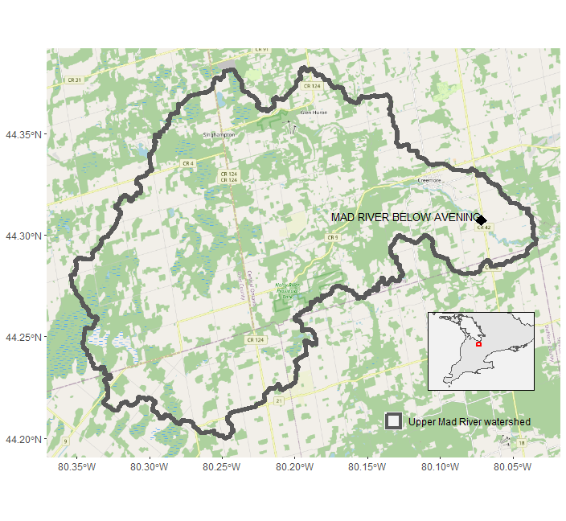
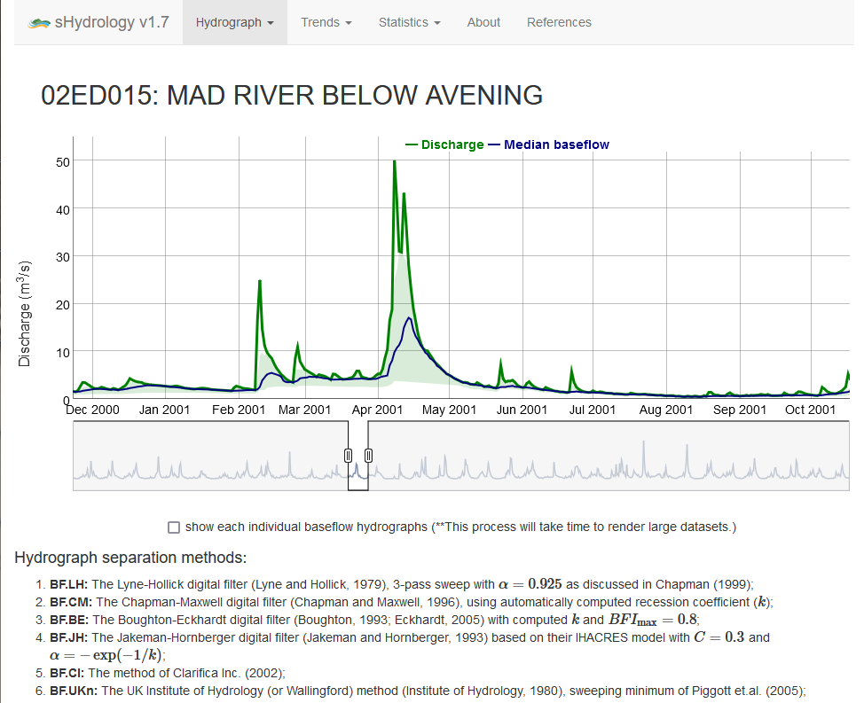
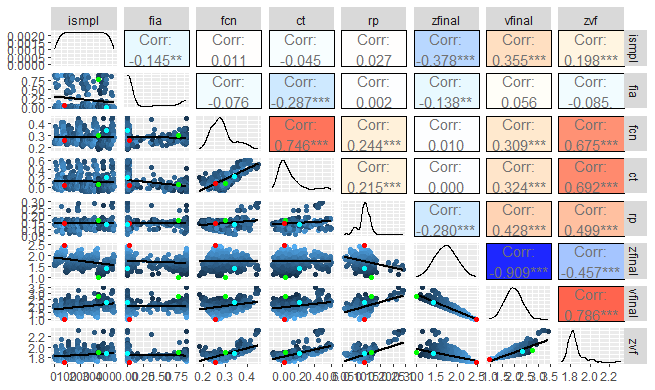

<style type="text/css">
  .table25 {width: 25%;}
</style>

```{r setup, include=FALSE}
knitr::opts_chunk$set(echo = TRUE)
library(dplyr)
library(tidyr)
# library(lubridate)
# library(mgcv)
library(ggplot2)
library(leaflet)
library(sf)
# library(leaflet.extras)
library(readxl)
library(knitr)

df <- read.csv("O:/MadRiver23/02-goHECHMS/HEC-HMS_subbasins.csv")
```


# Introduction

## Upper Mad River

The Nottawasaga Valley Conservation Authority (NVCA) and The Oak Ridges Moraine Groundwater Program (ORMGP) have partnered to explore the applicability of the ORMGP's [__historical climate data service__](/interpolants/modelling/waterbudget/data.html) in supporting event-based HEC-HMS models built in Southern Ontario to investigate the rainfall-runoff response to extreme summer rainfall events. As a proof of concept, the ~246km² Upper Mad River watershed was identified as a good first candidate.

<!--  -->

```{r basemap, echo=FALSE, message=FALSE, warning=FALSE}
source("basemap.R", local = TRUE)$value
```

*Upper Mad River watershed and the WSC gauge targeted for HEC-HMS calibration*

<br>

## HEC-HMS

The HEC-HMS model code and its construction proceeded in a manor to accommodate future continuous simulation  as planed by the NVCA. As such, the NVCA requested a "Deficit and Constant" method suitable for long term continuous modelling be included with the delivered model. The HEC-HMS model offered by the [US Army Corps of Engineers Hydrologic Engineering Center](https://www.hec.usace.army.mil/software/hec-hms/) includes such functionality as do many other model codes ([PRMS](https://www.usgs.gov/software/precipitation-runoff-modeling-system-prms), [Raven](http://raven.uwaterloo.ca/), [MikeSHE](https://www.mikepoweredbydhi.com/products/mike-she), [HydroGeoSphere](https://www.aquanty.com/hydrogeosphere), etc.), yet it was ultimately chosen due to the code:

1. being free of cost;
1. having an integrated Graphical User Interface (GUI);
1. having both event and continuous/deficit and constant modelling capabilities;
1. including powerful capabilities such as the [2D shallow water flow module included in HEC-RAS](https://www.hec.usace.army.mil/confluence/rasdocs/r2dum/latest/introduction/hec-ras-2d-modeling-advantages-capabilities).
1. being widely used both professionally and academically, thus making HEC-HMS the right application to be adopted institutionally due to its transferability.


*Snapshot of the Mad River HEC-HMS project*

<br>

## Design criteria

The model construction phase proceeded with certain constraints such that the model can be readily simulate continuous processes. For instance, the model was built with:

1. smaller (~10km²) subbasins commensurate with sub-watershed boundaries managed by the NVCA that also coincide with the ORMGP climate data service distribution. (In total there are 27 HEC-HMS Subbasins.)
1. watershed built using HEC-HMS's "GIS" functionality based on a 10m DEM.
1. applied map-based hydrologic processes (i.e., SCS curve method) that is best suited for simulating future land use change.


It's important to note that in practice, models are developed to be either event-based (e.g., individual extreme rainfall events) vs. continuous (e.g., long-term/seasonal hydrology, climate change, etc.) but rarely both. The ORMGP have maintains a near-real-time daily data set complete since 1901 built for long term continuous modelling needed for groundwater resource management. However, we also maintain a 6-hourly near-real-time climate data set since 2002. Both of these products are complete and are [spatially distributed to thousands of ~10km² sub-watersheds covering our jurisdiction](/interpolants/modelling/waterbudget/data.html).


The following snapshot has been prepared to assist the NVCA with preparation of HEC-HMS Technical Memo (Task 1.4) describing the methods used to compile necessary data, build the model, calibrate/verify the model and conduct a sensitivity analysis.

```{r sws.leaflet, echo=FALSE, message=FALSE, warning=FALSE}
subbasins <- st_transform(st_read("O:/MadRiver23/HEC-HMS/MadRiver23/maps/HEC-HMS_subbasins.shp", quiet=TRUE), 4326)

leaflet(subbasins) %>%
  addTiles() %>%
  
  addPolygons(color = "#444444", weight = 1, smoothFactor = 0.5,
              opacity = 1.0, fillOpacity = 0.25,
              fillColor = "lightgreen",
              label = ~paste0("Subbasin ",swsid),
              popup = ~paste0('<b>Subbasin ', swsid,"</b>",
                              '<br>drains to subbasin ', dssws,
                              '<br>(composite) CN: ', round(CN,0),
                              '<br>pecent Imperv: ', round(perimp*100,0),"&#37",
                              '<br>pecent Cover: ', round(percov*100,0),"&#37",
                              '<br>subbasin area: ', round(area,1), "km²",
                              '<br>reach length: ', round(fplen.km,1), "km"
                              ),
              highlightOptions = highlightOptions(
                opacity = 1, fillOpacity =1, weight = 5, sendToBack = FALSE
              )
  )
```

*click on watershed for more details*

<br>

# Data Collection

The target for the Data Collection (Task 1.1) piece was the for the implementation of the ORMGP climate data service. As each of the HEC-HMS subbasin mapped well to the ORMGP's sub-watershed delineation, rainfall data was nonetheless derived from the ~10km² [CaPA-RDPA](https://weather.gc.ca/grib/grib2_RDPA_ps10km_e.html) grid shown below.  Compared with meteorological stations, the CaPA-RDPA product offers a refined spatial distribution of precipitation amounts. Given that most extreme summer events are of the convective type, many of these storms are themselves small scale and are susceptible of being unobserved by the relatively coarse station network.


*HEC-HMS subasins vs CaPA-RDPA resolution vs Nearest Active hourly climate stations*

<br>

## Meteorological Data


Analyze meteorological data (precipitation, snow, temperature, radiation)


Locally, there exists 3 active meteorological stations having hourly precipitation data (click to view data):

1. [**6111792: COLLINGWOOD**](https://owrc.shinyapps.io/sHyMet/?sID=148613)
1. [**6117700: BARRIE-ORO**](https://owrc.shinyapps.io/sHyMet/?sID=697655275)
1. [**611E001: EGBERT CS**](https://owrc.shinyapps.io/sHyMet/?sID=360000028)


Annual precipitation in the region have seen mixed trends as of late. For instance Collingwood shows a increasing trend of annual precipitation volumes over the past 30 years, whereas a decreasing trend is found at Egbert CS and no trend at Barri-Oro. 


*mean daily temperature: 8°C*


## Streamflow Data


Analyze existing streamflow data (characterize large events (hydrograph analysis), baseflow analysis, statistical analysis)


Instantaneous (5min) streamflow data have been acquired from 2011 for [02ED015: MAD RIVER BELOW AVENING](https://wateroffice.ec.gc.ca/report/real_time_e.html?stn=02ED015).

([*From the daily historic records*](https://owrc.shinyapps.io/sHyStreamflow/?sID=149142)), it is evident that there is a change in flow regime occurring sometime in 2005, where annual runoff yeilds show a definite increase.


*cumulative discharge of both total flow and separated baseflow*




.png)


### Timescale

A comparison of timescales was performed to identify the model time step. 


### Recession Coefficient


*Automated recession coefficient estimate (ORMGP, 2023)*


$$
  Q_t=kQ_{t-1}
$$
for the Mad River at Avening:
$$
  k=0.979
$$


## Geospatial Data

Analyze applicable digital geospatial data sets including but not limited to soils, topography, land use to define hydrologic response units and appropriate catchments for the hydrologic model.


### DEM

The digital elevation model (DEM) defines the physical constraints of the HEC-HMS model. It was derived from the [Ontario Digital Elevation Model](https://geohub.lio.gov.on.ca/maps/mnrf::ontario-digital-elevation-model-imagery-derived/about) (OMRF, 2019b), specifically:

  1. SWOOP 2015, package B, and
  1. SCOOP 2013, package A.
  

[*metadata*](https://www.arcgis.com/sharing/rest/content/items/1ce266ee55c44ffca2d457bc5db13b92/info/metadata/metadata.xml?format=default&output=html)

<!--  -->


<br>


The 2m provincial DEM is upscaled to a 10m (horizontal resolution) DEM:

 - EPSG: 3161 NAD83 Ontario MNR Lambert
 - upper-left coordinate E:1,300,400; N:11,986,700
 - 2120 rows by 2600 columns (5,512,000 cells)
 

### Land Use

Combination of SOLRIS v.3.0 for land use type (OMNR, 2019a) and OGS (2010) to classify the Curve Number (CN) method "hydrologic soil group".


### Projected Layers

SOLRIS is provided as a set of land use identifiers. From these a look-up table is used to assign a data-based model parameter.

OGS 8 a set of "relative permebilities"


#### Percent Impervious


*based on SOLRIS*

#### Initial Abstraction


*relative vegetaiton cover based on SOLRIS*


#### Soil Characteristics


[Hydrologic Soil Group](https://directives.sc.egov.usda.gov/OpenNonWebContent.aspx?content=17757.wba)

Process soil characteristics

Using the "PERMEABILI" attribute of OGS (2010) soil characteristics needed to estimate infiltration loss parameters for the Upper Mad River Watershed were determined.


*relative infiltration rates based on OGS, 2010*


### Composite Layers

SOLRIS land use types and OGS's

#### Curve Number


*based on a geospatial overlay of SOLRIS and OGS*


<br>

# HEC-HMS modelling


Upper Mad River Hydrologic Modeling Using HEC-HMS (Task 1.2)


## Climate zones and subbasins

Delineate climate zones and subbasins and will complete meteorological and streamflow data processing for the Upper Mad River watershed.


## Model structure

```{r tbl.subbsn}
# kable(df, caption = 'cell-border stripe')

```


The HEC-HMS model of the Mad river consists of 27 subbasins, 25 of which drain to the sole hydrometric station at Avening. The HEC-HMS model was designed for event-based analysis using the SCS-CN methodology for runoff production, a Syder unit hydrograph for basin transfer, a simple lag function for reach transfer and a simple recession coefficient baseflow simulator activated by a ratio to simulated peak (USACE, 2000). 


The (sub-)model used in the HEC-HMS design include:
- Loss method: Soil Conservation Service (SCS) curve number
- Transform method: Snyder unit hydrograph
- Routing method: simple lag
- Routing method: simple recession


The "free" parameters are applied uniformly (i.e., globally) over the model. Differences in the water budgeting at each subbasin would then attributed to:
1. land use mapping
1. surficial geology mapping
1. topography (DEM), defining: 
 - subbasin shape and 
 - reach length.


## Model parameters

1. SCS Curve Number (CN) method for runoff generation (generated by mapping discussed above)
1. Initial abstraction for rainfall retention (generated by mapping discussed above)
1. $c_t$ Snyder unit hydrograph basin coefficient (global)
1. $c_p$ Snyder unit hydrograph peaking coefficient (global)
1. $k$ baseflow (simple) recession coefficient (global)
1. $r_p$ ratio to peak flow needed to specify the baseflow regime.
1. $lag$ Simple lag for reaches (global)
1. $f_{ia}$ a multiplicative factor applied globally to initial abstraction
1. $f_{CN}$ a multiplicative factor applied globally to CN


## Event Selection

A total of 12 annual extreme events were selected


## Model calibration and verification

The HEC-HMS hydrologic model was calibrated and verified using available streamflow gauge data (Task 1.3).  A range of annual extreme events exceeding the 2-yr return period are used to simulate the complete flow regime.

### Objective function

Minimize the peak-weighted root mean square error objective function (USACE, 1998)

$$
  Z = \sqrt{\frac{1}{n}\sum^n\left[ \left(q_s-q_o\right)^2\cdot\left(\frac{q_o-\overline{q_o}}{\overline{q_o}}\right)\right]}
$$


### Calibration


### Validation


### Sensitivity analysis


All 7 parameters ($t_p$, $c_p$, $k$, $r_p$, $lag$, $f_{ia}$, and $f_{CN}$) were fed into a Shuffled Complex Evolution (SCE - Duan et.al., 1993) optimization scheme. All events were optimized in this trial to assess two things:

1. inter-dependencies among model parameters. If the selection of a parameter can be confidently estimate by another (or an initial condition), then the dimensionality of the inverse problem is reduced
1. parameter identifiability: Are there optimized parameters that appear to seek a particular value?




*model parameter correlation matrix*


## Event modelling

the SCS Curve Number method for the  and the Timmins storm as per NVCA guidelines 


### Design Storms

Three forms synthetic hyetographs were developed to test design events now and under the changing climate. The Timmins Storm is pre-defined while the SCS design storms and the climate change projections are constructed using the "alternating block" synthetic hyetographs (NRC-PCS, 2018).

Application of these storms are multiplied by areal reduction factors (as function of the study area's "circular drainage area"--EWRG, 2017). Here, the Mad Rive model has an approximate 415 km² circular drainage area.

```{r results-load, include=FALSE}
  df.results.timmins <- read_excel("O:/MadRiver23/HEC-HMS/results/scenarios.xlsx",'Timmins')
  df.results.scsii <- read_excel("O:/MadRiver23/HEC-HMS/results/scenarios.xlsx",'SCSII')
  df.results.CC <- read_excel("O:/MadRiver23/HEC-HMS/results/scenarios.xlsx",'climate change')
```


#### Timmins Storm

A 193 mm, 12-hour storm was recorded in Timmins, Ontario on [August 31, 1961](https://www.canada.ca/en/environment-climate-change/services/water-overview/quantity/floods/events-ontario.html#Section3). With a 415 km² circular drainage area, the Timmins areal reduction factor would be 76%. It's hourly hyetograph is given as (EVA, 2017): 


<div class="table25">
| hour | precip. (mm) | reduced (mm) |
|:---|:---|:---|
| 1 | 15 | 11.4 |
| 2 | 20 | 15.2 |
| 3 | 10 | 7.6 |
| 4 | 3 | 2.28 |
| 5 | 5 | 3.8 |
| 6 | 20 | 15.2 |
| 7 | 43 | 32.68 |
| 8 | 20 | 15.2 |
| 9 | 23 | 17.48 |
| 10 | 13 | 9.88 |
| 11 | 13 | 9.88 |
| 12 | 8 | 6.08 |
</div>


#### SCS type II

The 2, 5, 10, 25, 50, 100-year SCS type II 24-hour design storms were re-casted as synthetic hyetographs using the alternate block method. 24-hour rainfall return periods were taken (conservatively) as the maximum posted 24-hour return intensities of four local meteorological stations: 


| return | Collingwood | Barrie | Egbert | Barrie Oro | max |
|:---|:---|:---|:---|:---|:---:|
|||||||
| 2 | 46.7 | 47.4 | 40.5 | 43.4 | 47.4 |
| 5 | 60.6 | 63.8 | 55.2 | 52.2 | 63.8 |
| 10 | 69.8 | 76.2 | 67.9 | 58.1 | 76.2 |
| 25 | 81.6 | 94.0 | 88.2 | 65.6 | 94.0 |
| 50 | 90.3 | 108.8 | 107.3 | 71.2 | 108.8 |
| 100 | 99.0 | 125.1 | 130.4 | 76.8 | 130.4 |

and the resulting hyetographs:

```{r scsii-rainfall, echo=FALSE, message=FALSE, warning=FALSE}
# scsii <- c( # 12-hour
#   0.020400000000000026,0.024949999999999996,0.03149999999999999,0.04018333333333332,
#   0.062425000000000015,0.45719166666666694,0.18298333333333305,0.05876666666666666,
#   0.04042499999999998,0.031925000000000064,0.02624166666666659,0.02300833333333337)
scsii <- c( # 24-hour
  0.009445833333333311, 0.011454166666666654, 0.01246250000000005, 0.01347083333333334, 
  0.014899999999999991, 0.01691666666666669, 0.018933333333333375, 0.02094999999999991, 
  0.026466666666666774, 0.033724999999999956, 0.05248333333333332, 0.384241666666667, 
  0.15361666666666748, 0.04935000000000006, 0.03395833333333338, 0.026858333333333314, 
  0.0219541666666667, 0.019362499999999987, 0.016837499999999953, 0.014395833333333307, 
  0.012766666666666709, 0.012349999999999977, 0.01175416666666671, 0.01134583333333331)
df.scs <- data.frame('hour'=seq(length(scsii)), scsii=scsii) %>%
  mutate('2yr' = scsii*47.4,
         '5yr' = scsii*63.8,
         '10yr' = scsii*76.2,
         '25yr' = scsii*94.0,
         '50yr' = scsii*108.8,
         '100yr' = scsii*130.4) %>%
  subset(select=-scsii) %T>%
  write.csv('scsii.csv', row.names = F) %>%
  gather("return", "precip", -hour) %>%
  mutate(return = factor(return, levels=c('2yr','5yr','10yr','25yr','50yr','100yr')))

df.scs %>% ggplot(aes(hour,precip)) + 
  theme_bw() +
  geom_step(aes(color=return), linewidth=1) +
  labs(title="SCS type II 24-hour design storms", y="rainfall (mm/hr)") +
  scale_colour_viridis_d(direction = -1, end = 0.9) +
  xlim(c(1,24))
```


#### Results

*todo*


### Climate Change


alternating block
[IDF-CC](https://www.idf-cc-uwo.ca/) tool (Simonovic et.al., 2015)


1. The [IDF-CC](https://www.idf-cc-uwo.ca/) design support tool was used to acquire current and projected Intensity-Duration-Frequency (IDF) curves. From this tool, the [CMIP6](https://esgf-node.llnl.gov/projects/cmip6/) ensemble, downscaled and biased corrected as per [PCIC](https://www.pacificclimate.org/data/statistically-downscaled-climate-scenarios), are packaged into future projected IDF curves.
1. 3 climate change scenarios (RCP 2.4, 4.5 and 8.5) are considered.
1. IDFs produced for the time horizons 2015-2045 and 2045-2100 are compared with current IDF curves, 3 IDFs per scenario.
1. The 100-year return precipitation events are created using the alternating block approach following the Natural Resources Canada document: *Case studies on climate change in floodplain mapping*.

In total this comes to $3\times 3 \times 1=9$


#### IDF

IDFs are defined by (Simonovic et.al., 2015):

$$
  i=A\cdot \left(t+t_0\right)^B
$$

where $i$ is rainfall rate (mm/hr), $t$ duration of precipitation event (hr), $A$, $B$ and $t_0$ are coefficients provided by the IDF-CC tool.


T (years) |	Coefficient $A$ |	Coefficient $B$ |	Coefficient $t_0$
2  	22.1	-0.755	0.070
5  	30.1	-0.771	0.091
10	35.6	-0.780	0.103
20	40.9	-0.788	0.112
25	42.6	-0.790	0.115
50	47.8	-0.796	0.123
100	53.0	-0.802	0.129


<br>


## Discussion

> Place-holder

- 2013 storm issues
- flashy system
  - <15min resolution rocemmended
  - had to eliminate reach lag to match rising limbs
- $\text{LAI}=5$
- baseflow dependence: retention times seem differ by month


<br>

# References

Duan, Q.Y., V.K. Gupta, and S. Sorooshian, 1993. Shuffled Complex Evolution Approach for Effective and Efficient Global Minimization. Journal of Optimization Theory and Applications 76(3) pp.501-521.

Environmental Water Resoureces Group, 2017. Technical Guidelines for Flood Hazard Mapping (March, 2017). 137pp.

Natural Resources Canada, Public Safety Canada. 2018. Case studies on climate change in floodplain mapping v.1 ANNEX C: FLOOD MAPPING AND CLIMATE CHANGE: WATERFORD RIVER CASE STUDY ANALYSIS.

Oak Ridges Moraine Groundwater Program (2023). sHydrology stream flow analysis tool [Online image]. https://www.oakridgeswater.ca/

Ontario Geological Survey 2010. Surficial geology of southern Ontario; Ontario Geological Survey, Miscellaneous Release— Data 128 – Revised.

Ontario Ministry of Natural Resources and Forestry, 2019a. Southern Ontario Land Resource Information System (SOLRIS) Version 3.0: Data Specifications. Science and Research Branch, April 2019

Ontario Ministry of Natural Resources and Forestry, 2019b. Ontario Digital Elevation Model (Imagery-Derived).

Simonovic, S.P., A. Schardong, R. Srivastav, and D. Sandink (2015), IDF_CC Web-based Tool for Updating Intensity-Duration-Frequency Curves to Changing Climate – ver 6.5, Western University Facility for Intelligent Decision Support and Institute for Catastrophic Loss Reduction, open access https://www.idf-cc-uwo.ca.

US Army Corps of Engineers, USACE (1998). HEC-1 flood hydrograph package user's manual. Hydrologic Engineering Center, Davis, CA.

US Army Corps of Engineers, USACE (2000). Hydrologic Modeling System HEC-HMS Technical Reference Manual. Hydrologic Engineering Center, Davis, CA.
