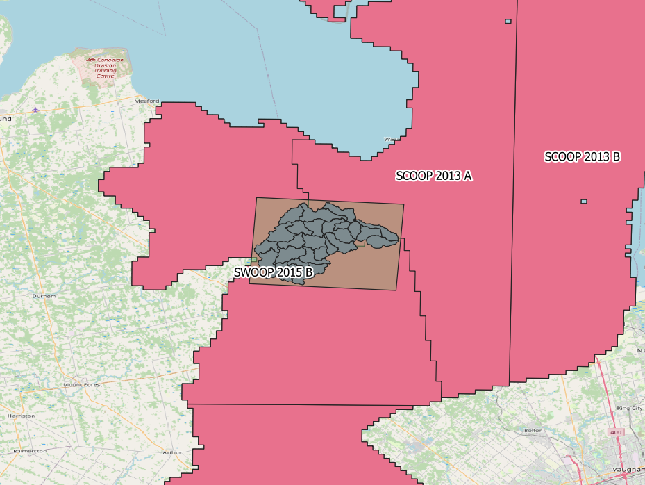

<style type="text/css">
  .table25 {width: 25%;}
  .table50 {width: 50%;}
  .table75 {width: 75%;}
</style>

```{r setup, include=FALSE}
knitr::opts_chunk$set(echo = TRUE)
library(dplyr)
library(tidyr)
# library(lubridate)
# library(mgcv)
library(ggplot2)
library(ggrepel)
library(leaflet)
library(sf)
# library(leaflet.extras)
library(readxl)
library(knitr)
library(stringr)
library(kableExtra)
```

```{r main.load, include=FALSE}
df <- read.csv("O:/MadRiver23/02-goHECHMS/HEC-HMS_subbasins.csv")
```


# Introduction

## Upper Mad River

The Nottawasaga Valley Conservation Authority (NVCA) and The Oak Ridges Moraine Groundwater Program (ORMGP) have partnered to explore the applicability of the [__ORMGP's historical climate data service__](/interpolants/modelling/waterbudget/data.html) in supporting event-based HEC-HMS models built in Southern Ontario to investigate the rainfall-runoff response to extreme summer rainfall events. As a proof of concept, the ~246km² Upper Mad River watershed was identified as a good first candidate.

<!--  -->

```{r basemap, echo=FALSE, message=FALSE, warning=FALSE}
source("basemap.R", local = TRUE)$value
```

*Upper Mad River watershed and the Water Survey of Canada (WSC) gauge targeted for HEC-HMS calibration*

<br>

## HEC-HMS

The HEC-HMS model development proceeded in a manor to accommodate future long-term continuous simulations planed by the NVCA. As such, the NVCA requested a "Deficit and Constant" method suitable for long term continuous modelling be included with the delivered model. The HEC-HMS model code offered by the [US Army Corps of Engineers Hydrologic Engineering Center](https://www.hec.usace.army.mil/software/hec-hms/) includes such functionality as do many other model codes investigated (including [PRMS](https://www.usgs.gov/software/precipitation-runoff-modeling-system-prms), [Raven](http://raven.uwaterloo.ca/), [MikeSHE](https://www.mikepoweredbydhi.com/products/mike-she), [HydroGeoSphere](https://www.aquanty.com/hydrogeosphere), etc.), yet it was ultimately chosen due to the code:

1. being free of cost;
1. having an integrated Graphical User Interface (GUI);
1. having both event and continuous/deficit and constant modelling capabilities;
1. including powerful capabilities such as the [2D shallow water flow module included in HEC-RAS](https://www.hec.usace.army.mil/confluence/rasdocs/r2dum/latest/introduction/hec-ras-2d-modeling-advantages-capabilities).
1. being widely used both professionally and academically, thus making HEC-HMS the right application to be adopted institutionally due to its transferability.


*Snapshot of the Mad River HEC-HMS project*

<br>

## Design Criteria

The model construction phase proceeded with certain constraints such that the model can be readily simulate continuous processes. For instance, the model was built with:

1. smaller (~10km²) subbasins commensurate with sub-watershed boundaries managed by the NVCA that also coincide with the ORMGP climate data service distribution. (In total there are 27 HEC-HMS Subbasins.)
1. watershed built using HEC-HMS's "GIS" functionality based on a 10m DEM.
1. applied map-based hydrologic processes (i.e., SCS curve method) that is best suited for simulating future land use change.


It's important to note that in practice, models are developed to be either event-based (e.g., individual extreme rainfall events) vs. continuous (e.g., long-term/seasonal hydrology, climate change, etc.) but rarely both. The ORMGP maintains a near-real-time daily data set complete since 1901 built for long term continuous modelling needed for groundwater resource management. However, we also maintain a 6-hourly near-real-time climate data set since 2002. Both of these products are complete and are [spatially distributed to thousands of ~10km² sub-watersheds covering our jurisdiction](/interpolants/modelling/waterbudget/data.html).


The following snapshot has been prepared to assist the NVCA with preparation of HEC-HMS Technical Memo (Task 1.4) describing the methods used to compile necessary data (Task 1.1), build the model (Task 1.2), calibrate/verify the model and conduct a sensitivity analysis (Task 1.3).

<a name="sws.leaflet"></a><br>

```{r sws.leaflet, echo=FALSE, message=FALSE, warning=FALSE}
subbasins <- st_transform(st_read("O:/MadRiver23/HEC-HMS/MadRiver23/maps/HEC-HMS_subbasins.shp", quiet=TRUE), 4326)

leaflet(subbasins) %>%
  addTiles() %>%
  
  addPolygons(color = "#444444", weight = 1, smoothFactor = 0.5,
              opacity = 1.0, fillOpacity = 0.25,
              fillColor = "lightgreen",
              label = ~paste0("Subbasin ",swsid),
              popup = ~paste0('<b>Subbasin ', swsid,"</b>",
                              '<br>drains to subbasin ', dssws,
                              '<br>(composite) CN: ', round(CN,0),
                              '<br>pecent Imperv: ', round(perimp*100,0),"&#37",
                              '<br>pecent Cover: ', round(percov*100,0),"&#37",
                              '<br>subbasin area: ', round(area,1), "km²",
                              '<br>reach length: ', round(fplen.km,1), "km"
                              ),
              highlightOptions = highlightOptions(
                opacity = 1, fillOpacity =1, weight = 5, sendToBack = FALSE
              )
  )
```

*Mad River HEC-HMS subbasins (click on watershed for more details)*

<br>

# Data Collection

The target for the Data Collection (Task 1.1) piece was the for the implementation of the ORMGP climate data service. As each of the HEC-HMS subbasin mapped well to the ORMGP's sub-watershed delineation, rainfall data was nonetheless derived from the ~10km² [CaPA-RDPA](https://weather.gc.ca/grib/grib2_RDPA_ps10km_e.html) grid shown below.  Compared with meteorological stations, the CaPA-RDPA product offers a finer spatial distribution of precipitation amounts. Given that southern Ontario extreme summer events are typically of the convective type (Klaassen, 2014), many of these storms are themselves small in scale and are susceptible of being unobserved by southern Ontario's relatively coarse station network.


*HEC-HMS subbasins vs. CaPA-RDPA resolution vs Nearest Active hourly climate stations.*

<br>

## Meteorological Data


Meteorological data (i.e., precipitation, snow, temperature, radiation) are analysed. Locally, there exists 3 active meteorological stations having hourly precipitation data (click to view ORMGP's *"sHydrology"* data analysis suite):

1. [**6111792: COLLINGWOOD**](https://owrc.shinyapps.io/sHyMet/?sID=148613)
1. [**6117700: BARRIE-ORO**](https://owrc.shinyapps.io/sHyMet/?sID=697655275)
1. [**611E001: EGBERT CS**](https://owrc.shinyapps.io/sHyMet/?sID=360000028)


Annual precipitation in the region have seen mixed trends as of late. For instance Collingwood shows a increasing trend of annual precipitation volumes over the past 30 years, whereas a decreasing trend is found at Egbert CS and no trend is identified at Barrie-Oro. Trends are assessed both visually and objectively using the Mann-Kendall test for trend (p<0.05) using annual precipitation accumulations in years having complete data.


*Annual totals of precipitation. Red outlines signify years that do not pass the [WMO 3/5 rule](https://climate.weather.gc.ca/glossary_e.html#wmo_standards).*

<br>

Mean annual snowpack depths appear to be on the decline as see at Egbert CS. (Note: Mann-Kendall test for trend was not applied as snowpacks do not persist year-round.)


*Mean annual snowpack depth (cm). (Snow depth is not monitored at Collingwood)*

<br>

Lastly, air temperatures at all location stations do not appear to show any trend:


*Departure from mean daily temperature (8°C) at Collingwood*

<br>

### 24-hour Precipitation Returns

Below shows the frequency analysis performed the 24-hour accumulations observed in Collingwood. From 22 years of data, the extrapolated 100-year 24-hour storm looks to be close to ~150 mm:


*Projected 24-hour accumulated precipitation frequency plot*


## Streamflow Data

Next, streamflow data are analysed to characterize large events based on hydrograph, baseflow, statistical analyses. Instantaneous (5 min) streamflow records have been acquired since 2011 at [02ED015: MAD RIVER BELOW AVENING](https://wateroffice.ec.gc.ca/report/real_time_e.html?stn=02ED015). This station is the sole hydrometric station available for model calibration.

### Flow Regime

[From the daily historic records at 02EC015](https://owrc.shinyapps.io/sHyStreamflow/?sID=149142), it is apparent that there is a change in flow regime occurring sometime in 2005, where annual runoff yields show a definite increase relative to the pre-2005 period. This can be shown using cumulative discharge plots of both total flow and baseflow. 


*cumulative discharge of both total flow and separated baseflow.*

<br>

Baseflow was determined as the median of [14 automated hydrograph separation methologies](https://owrc.github.io/info/hydrographseparation/). Below illustrates the wide range in baseflow estimates as the green ribbon and the median value in blue:


*A sample of baseflow separation performed on the Mad River (02ED015) hydrograph.*

<br>

Aggregating baseflow approximations during each calendar month shows significant seasonality in the baseflow regime that is clearly dominated by the spring freshet. Consequently, annual extreme discharge tends to occur during the spring months when water tables are high and snow is melting, making for wet antecedent conditions.


*Distributions of monthly baseflow discharge. Notice how March-April-May have significantly greater yields than the rest of the year.*

<br>


*Distribution of annual extremes shows prevalence for spring occurrence.*

<br>

### Peak Flow Events

For model calibration, efforts were made to isolate events that are not caused by snowmelt nor occurred during seasonally wet/freshet conditions. This way, the rainfall-runoff relationship can be assessed without any additional influence of wet conditions. Only events occurring from June through September are considered.  

<a name="extr.freq"></a><br>

.png){width=75%}

*Peak flow frequency of summer (Jun-Sep) events only. Calibration and validation events are encircled.*

<br>

```{r evnt.table, echo=FALSE, message=FALSE, warning=FALSE}
read.csv("E:/Sync/@dev/go/src/ORMGP Modelling/HEC-HMS/event-summary-MadRiver23.csv") %>%
  filter(year!=2013) %>%
  subset(select=-c(dtb,dte)) %>%
  rename('Year'='year', 'Rainfall (mm)'='ptot', "Runoff (mm)"='qtot', "Peak Discharge (m³/s)"='qmax', "Initial Discharge (m³/s)"='q0') %>%
  arrange(Year) %>%
  mutate(`Use*`=c('valid.','valid.','valid.','calibr.','calibr.','valid.','calibr.','calibr.','valid.','calibr.','calibr.')) %>%
  relocate(`Use*`, .after = Year) %>%
  kable(caption = 'Selected extreme flow events for modelling to 02ED015.', digits=1, format = "html", table.attr = "style='width:80%;'") %>%
  kable_styling(position = "left")
```

_* calibr.=calibration; valid.=validation_

<br>

### Timescale

A comparison of timescales was performed to identify the model time step. Discharge is available at the 5 minute time step, which is considered close to instantaneous. Below, the instantaneous data are aggregated 4 ways: 15-minute rolling average, 6-hour rolling average, 24-hour rolling average and the daily mean step function. While little difference can be seen at the 15-minute interval, discrepancies tend to show the coarser the time step: daily peak discharge tend to be half that of the instantaneous peak discharge during summer events. 

{width=75%}

*Comparison of streamflow at different averaging intervals at [02ED015: MAD RIVER BELOW AVENING](https://wateroffice.ec.gc.ca/report/real_time_e.html?stn=02ED015).*

<br>

Most importantly, the 6-hourly hydrograph exhibits minor difference from the instantaneous hydrograph for 2-10 year events, which is promising as the input climate data set used in this exercise is aggregated to this scale. The model is set to run at a 15 minute time step.


### Recession Coefficient

A HEC-HMS model input is the baseflow coefficient: an exponential law of streamflow recession. Web applications hosted by the ORMGP contains an automated recession coefficient calculator by plotting discharge vs, the discharge the following day, if and only if the succeeding day's discharge is the lesser of the two. The slope of the plotting a line enveloping the base of the scatter plot defines the recession coefficient:

{width=75%}

*Automated recession coefficient estimate (ORMGP, 2023).*

<br>

Recession coefficient $k$ is defined as:

$$
  Q_t=kQ_{t-1}
$$
for the Mad River at Avening:

$$
  k=0.979
$$

<br>


## Geospatial Data

The HEC-HMS model design is dependent on a number of digital geospatial data sets including but not limited to soils and land use mapping that define the function of "hydrologic response units" (HRUs), and topography needed delineate appropriate catchment areas, define flow lengths and catchment slopes.


### DEM

The digital elevation model (DEM) defines the physical constraints of the HEC-HMS model. It was derived from the [Ontario Digital Elevation Model](https://geohub.lio.gov.on.ca/maps/mnrf::ontario-digital-elevation-model-imagery-derived/about) (OMRF, 2019b), specifically:

  1. SWOOP 2015, package B, and
  1. SCOOP 2013, package A.


<!--  -->


*Screen capture of the Provincial DEM source. [metadata](https://www.arcgis.com/sharing/rest/content/items/1ce266ee55c44ffca2d457bc5db13b92/info/metadata/metadata.xml?format=default&output=html).*

<br>


The 2m provincial DEM is upscaled to a 10m (horizontal resolution) DEM raster with:

 - a EPSG: 3161 NAD83 Ontario MNR Lambert projection;
 - an upper-left coordinate E:1,300,400; N:11,986,700; and,
 - 2120 rows by 2600 columns (5,512,000 cells)
 
Using HEC-HMS's native ["GIS" package](https://www.hec.usace.army.mil/confluence/hmsdocs/hmsguides/gis-tutorials-and-guides), the DEM was used to define subbasins. Some manual alterations were applied to align the subbasins with existing catchment areas employed by the NVCA. 


### Land Use and Surficial Geology


SOLRIS v3.0 (OMNR, 2019a) provides as a set of land use identifiers. From these, a look-up table is used to assign data-based model parameters such as percent imperviousness and initial abstractions.


#### Percent Impervious

{width=85%}

*Percent imperviousness based on SOLRIS mapping.*

<a name="lusg.ia"></a>
#### Initial Abstraction

With SOLRIS land use mapping, canopy cover density is distributes to provides first estimates of initial abstraction capacities:

{width=85%}

*Relative vegetation cover based on SOLRIS mapping.*

<br>

#### Soil Characteristics

Surficial Geology (OGS, 2010) defines soil characteristics. The OGS layers are attributed with a set of relative permeabilities used to map ["Hydrologic Soil Groups"](https://directives.sc.egov.usda.gov/OpenNonWebContent.aspx?content=17757.wba). For the *"PERMEABILI"* attribute of the OGS (2010) layer, soil groups (A, B, C, D) are mapped to (High, Medium, Low-medium, Low) permeabilities. 


needed to estimate infiltration loss parameters for the Upper Mad River Watershed are determined:

{width=85%}

*Relative infiltration rates based on OGS (2010). The darker the blue, the less permeable the soil.*


### Composite Layers


SOLRIS land use (OMNR, 2019a) and OGS (2010) surficial geology are combined to determine SCS Curve Numbers (CN) using standard [SCS lookup tables](https://www.hec.usace.army.mil/confluence/hmsdocs/hmstrm/cn-tables).


#### Curve Number

{width=85%}

*SCS Curve Numbers based on a geospatial overlay of SOLRIS and OGS surficial geology. Darker blue: higher CN.*


<br>


# HEC-HMS modelling


Upper Mad River Hydrologic Model is built using [HEC-HMS](https://www.hec.usace.army.mil/software/hec-hms/) (Task 1.2). The HEC-HMS model consists of 27 subbasins, 25 of which drain to the sole hydrometric station at Avening. The HEC-HMS model was designed for event-based analysis using the SCS-CN methodology for runoff generation, a Syder unit hydrograph for basin transfer, a simple lag function for reach transfer and a simple recession coefficient baseflow simulator activated by a ratio to simulated peak (USACE, 2000).  


## Climate zones and subbasins

Climate zones/subbasins are delineated based on the DEM and were built internally using HEC-HMS's GIS package. Meteorological and streamflow data processing for the Upper Mad River watershed are confined within these bounds:


*Map of HEC-HMS-derived subbasins (blue) comapred to the basins provided by the NVCA (red).*

<br>


## Model structure

<!-- ```{r tbl.subbsn, echo=FALSE, message=FALSE, warning=FALSE} -->
<!-- kable(df, caption = 'cell-border stripe', format = "html", table.attr = "style='width:30%;'") -->
<!-- ``` -->


The (sub-)models used in the HEC-HMS design include:
- Loss method: Soil Conservation Service (SCS) curve number
- Transform method: Snyder unit hydrograph
- Routing method: simple lag
- Routing method: simple recession


## Model parameters

Some "free" parameters are applied uniformly (i.e., globally) across the model. Differences in the water budgeting at each subbasin would then attributed to:

1. land use mapping
1. surficial geology mapping
1. topography (DEM), defining: 
 - subbasin form;
 - channel length; and 
 - channel slope.

[*Subbasin parameter assignment can be inspected above.*](#sws.leaflet)

Calibration parameters include:

1. SCS Curve Number (CN) method for runoff generation (generated by mapping discussed above)
1. Initial abstraction for rainfall retention (generated by mapping discussed above)
1. Subbasin area and topology (based on DEM topography)
1. $c_t$ Snyder unit hydrograph basin coefficient (global)
1. $c_p$ Snyder unit hydrograph peaking coefficient (global)
1. $k$ baseflow (simple) recession coefficient (global), calculated above
1. $r_p$ ratio to peak flow needed to specify the baseflow regime (global)
1. $lag$ Simple lag for reaches (dependent on reach length)
1. $Q_0$ is the initial discharge, set to the observed discharge at the beginning of the model run
1. $f_{ia}$ a multiplicative factor applied globally to initial abstraction
1. $f_{CN}$ a multiplicative factor applied globally to CN


## Event Selection

A total of 11 annual extreme events are selected, 6 used for calibration, 5 for validation. All selected events exceed bankfull discharge (defined here as events exceeding the 1.5 year return flow). Events are [highlighted above](#extr.freq).  

Selection of the calibration and validation events were made randomly from the initial 11 events. A twelfth event, occurring in 2013 looks to be a choice event, but for reasons discussed below, this event had to be excluded, unfortunately.


## Model calibration and verification

The HEC-HMS hydrologic model was calibrated and verified using available streamflow gauge data (Task 1.3). A range of annual extreme events exceeding the 1.5-yr return period are used to simulate the flood flow regime.

The events selected provide a wide range of peak discharges for both the calibration and validation exercises. Given that there's only a decades worth of events, it is unlikely that extreme discharges (say greater than a 20-year return) have not been observed and will thus not constrain the model.


### Objective function

Calibration and validation was optimized both by visual fit and objective function minimization. The objective function targeted is the peak-weighted root mean square error described in USACE (1998):

$$
  Z = \sqrt{\frac{1}{n}\sum^n\left[ \left(q_s-q_o\right)^2\cdot\left(\frac{q_o-\overline{q_o}}{\overline{q_o}}\right)\right]}
$$

where $q_s$, $q_o$ and $\overline{q_o}$ are the simulated, observed and mean-observed discharge respectively.


### Calibration

The model fairs well at matching peak discharge for a wide range of events up to the 10-year return. There are 2 characteristically different hydrographs observed amongst the calibration set: 2014, 2018 and 2020 exhibit a short-duration flashy response, while 2010, 2011 and 2015 demonstrate events that appear to have greater storage and lag. This lag may be a sign of wetter antecedent conditions as the initial discharge $Q_0$ tend to be higher compared to the flashy events.


*Calibration performed to 6 annual extreme events.*

<br>


### Validation

The validation events as expected don't perform as well as the calibration set. Overall 3 of the 5 (2002, 2008 and 2012) performed well. During the iterative process of calibration and validation, years 2009 and 2017 were notoriously difficult to hone in, without sacrificing the performance of the calibration set. They are nonetheless included here for the sake of transparency.


*Validation performed to 5 annual extreme events.*

<br>


### Sensitivity analysis

FIve parameters ($c_t$, $r_p$, $lag$, $f_{ia}$, and $f_{CN}$) were fed into a Shuffled Complex Evolution (SCE - Duan et.al., 1993) optimization scheme. Subbasin lag coefficient performed best when minimized ($t_p=0$) , indicating that the upper Mad River watershed modelled is quite flashy. (The recession coefficient $k$ was determined from flow records and the Snyder UH peaking coefficient was kept at a constant value $c_p=0.4$.) A global calibration is performed on subsets of 6 The 11 events. Choosing 6 of 11 events yields $_{11}C_6=462$ SCE trials that are optimized and compared to assess two crucial issues with numerical model calibration, namely:

1. Parameter inter-dependence: Can the selection of a parameter value be confidently estimated by another parameter, if so, then the dimensionality of the inverse problem is reducible, and
1. parameter identifiability: Are there optimized parameters that appear to seek a particular/unique value?

Below the results are presented in the form of a correlation matrix. This figure will highlight cross-correlation either visually (lower-left scatter plots) and statistically (upper-right listed coefficient of determinations). Identifiability can be determined visually from the density plots along the diagonal: plots that show greater peakedness (less spread) are deemed most sensitive to change.


*Model parameter correlation matrix built for sensitivity analysis. `zfinal` is the average peak-weighted RMSE minimized by the SCE scheme.*

<br>

It is evident from the above plot that:

1. initial abstraction $(i_a)$ and reach $lag$ appear to perform best when minimized---resulting from the flashiness of the selected events;
1. ratio to peak $(r_p)$ appears to be the most identifiable, meaning the its calibrated value has the greatest confidence and that the model is most sensitive to change in $r_p$; and
1. CN values appear to correlate well with the Snyder UH basin coefficient $(c_t)$---meaning that changes to one parameter can be compensated by the other, and thus the model's sensitivity to these parameters would have been overstated should a global sensitivity analysis (as done here) had not been performed.

<br>


## Event modelling

With the calibrated parameter set, the model is then run through a set of scenarios. Two designed storms, the SCS type II method and the Timmins storm are applied as per NVCA guidelines. In addition, a projected storm under a changing climate is applied. 


### Design Storms

Three forms synthetic hyetographs are developed to test design events now and under the changing climate. The Timmins Storm is pre-defined while the SCS type II design storms and the climate change projections are constructed using the "alternating block" synthetic hyetographs (NRC-PCS, 2018).

Application of these storms are multiplied by areal reduction factors (as function of the study area's "circular drainage area"---EWRG, 2017). Here, the Mad Rive model has an approximate 415 km² circular drainage area.

```{r results-load, include=FALSE}
  df.results.timmins <- read_excel("O:/MadRiver23/HEC-HMS/results/scenarios.xlsx",'Timmins')
  df.results.scsii <- read_excel("O:/MadRiver23/HEC-HMS/results/scenarios.xlsx",'SCSII')
  df.results.CC <- read_excel("O:/MadRiver23/HEC-HMS/results/scenarios.xlsx",'climate change')
```


#### Timmins Storm

A 193 mm, 12-hour storm was recorded in Timmins, Ontario on [August 31, 1961](https://www.canada.ca/en/environment-climate-change/services/water-overview/quantity/floods/events-ontario.html#Section3). With a 415 km² circular drainage area, the Timmins areal reduction factor would be 76%. It's hourly hyetograph is given as (EVA, 2017): 


<div class="table50">
| hour | Acc. Precip. (mm) | Reduced (mm) |
|:---|:---|:---|
| 1 | 15 | 11.4 |
| 2 | 20 | 15.2 |
| 3 | 10 | 7.6 |
| 4 | 3 | 2.28 |
| 5 | 5 | 3.8 |
| 6 | 20 | 15.2 |
| 7 | 43 | 32.68 |
| 8 | 20 | 15.2 |
| 9 | 23 | 17.48 |
| 10 | 13 | 9.88 |
| 11 | 13 | 9.88 |
| 12 | 8 | 6.08 |
</div>


#### SCS type II

The 2, 5, 10, 25, 50, 100-year SCS type II 24-hour design storms were re-casted as synthetic hyetographs using the alternate block method. 24-hour rainfall return periods were taken (conservatively) as the maximum posted 24-hour return intensities of four local meteorological stations: 

<div class="table75">
| T (years) | Collingwood | Barrie | Egbert | Barrie Oro | max |
|:---|:---|:---|:---|:---|:---:|
| 2 | 46.7 | 47.4 | 40.5 | 43.4 | 47.4 |
| 5 | 60.6 | 63.8 | 55.2 | 52.2 | 63.8 |
| 10 | 69.8 | 76.2 | 67.9 | 58.1 | 76.2 |
| 25 | 81.6 | 94.0 | 88.2 | 65.6 | 94.0 |
| 50 | 90.3 | 108.8 | 107.3 | 71.2 | 108.8 |
| 100 | 99.0 | 125.1 | 130.4 | 76.8 | 130.4 |
</div><br>

and the resulting hyetographs:

```{r scsii-rainfall, echo=FALSE, message=FALSE, warning=FALSE}
# scsii <- c( # 12-hour
#   0.020400000000000026,0.024949999999999996,0.03149999999999999,0.04018333333333332,
#   0.062425000000000015,0.45719166666666694,0.18298333333333305,0.05876666666666666,
#   0.04042499999999998,0.031925000000000064,0.02624166666666659,0.02300833333333337)
scsii <- c( # 24-hour
  0.009445833333333311, 0.011454166666666654, 0.01246250000000005, 0.01347083333333334, 
  0.014899999999999991, 0.01691666666666669, 0.018933333333333375, 0.02094999999999991, 
  0.026466666666666774, 0.033724999999999956, 0.05248333333333332, 0.384241666666667, 
  0.15361666666666748, 0.04935000000000006, 0.03395833333333338, 0.026858333333333314, 
  0.0219541666666667, 0.019362499999999987, 0.016837499999999953, 0.014395833333333307, 
  0.012766666666666709, 0.012349999999999977, 0.01175416666666671, 0.01134583333333331)
df.scs <- data.frame('hour'=seq(length(scsii)), scsii=scsii) %>%
  mutate('2yr' = scsii*47.4,
         '5yr' = scsii*63.8,
         '10yr' = scsii*76.2,
         '25yr' = scsii*94.0,
         '50yr' = scsii*108.8,
         '100yr' = scsii*130.4) %>%
  subset(select=-scsii) %T>%
  write.csv('scsii.csv', row.names = F) %>%
  gather("return", "precip", -hour) %>%
  mutate(return = factor(return, levels=c('2yr','5yr','10yr','25yr','50yr','100yr')))

df.scs %>% ggplot(aes(hour,precip)) + 
  theme_bw() + theme(legend.position = c(.9,.9), legend.justification = c(1,1)) +
  geom_step(aes(color=return), linewidth=1) +
  labs(title="SCS type II 24-hour design storms", y="rainfall (mm/hr)") +
  scale_colour_viridis_d(direction = -1, end = 0.9) +
  xlim(c(1,24))
```

*SCS type II 24-hour design storm hyetographs*

<br>

#### Results

```{r timmins.result, echo=FALSE, message=FALSE, warning=FALSE}
df.results.timmins %>%
  ggplot() + theme_bw() + geom_line(aes(minute/60,cms), linewidth=1) +
  labs(x="hour",y="discharge (m³/s)",title="Timmins design storms",subtitle="02ED015: Mad River below Avening")
```

```{r scsii.result, echo=FALSE, message=FALSE, warning=FALSE}
f1 = 8
x0 = 17
df.results.scsii %>%
  ggplot(aes(x=minute/60)) + 
    theme_bw() +
    geom_line(aes(y=`2yr`), linewidth=1) + 
    geom_line(aes(y=`5yr`), linewidth=1) + 
    geom_line(aes(y=`10yr`), linewidth=1) + 
    geom_line(aes(y=`25yr`), linewidth=1) + 
    geom_line(aes(y=`50yr`), linewidth=1) + 
    geom_line(aes(y=`100yr`), linewidth=1) +
    # geom_line(data=df.results.timmins, aes(y=cms))
    annotate('text',x=x0,y=f1+max(df.results.scsii$`2yr`),label="2yr") +
    annotate('text',x=x0,y=f1+max(df.results.scsii$`5yr`),label="5yr") +
    annotate('text',x=x0,y=f1+max(df.results.scsii$`10yr`),label="10yr") +
    annotate('text',x=x0,y=f1+max(df.results.scsii$`25yr`),label="25yr") +
    annotate('text',x=x0,y=f1+max(df.results.scsii$`50yr`),label="50yr") +
    annotate('text',x=x0,y=f1+max(df.results.scsii$`100yr`),label="100yr") +
    labs(x="hour",y="discharge (m³/s)",title="SCS type II 24-hour duration design storms",subtitle="02ED015: Mad River below Avening")
```


### Climate Change

Climate change scnearios are built using projected IDF curves offer by the [IDF-CC](https://www.idf-cc-uwo.ca/) tool (Simonovic et.al., 2015). Like the SCS method, the alternating block approach is used to convert the IDF curve into a design hyetograph. The IDF-CC design storm is processed as follows:

1. The [IDF-CC](https://www.idf-cc-uwo.ca/) design support tool was used to acquire current and projected Intensity-Duration-Frequency (IDF) curves. From this tool, the [CMIP6](https://esgf-node.llnl.gov/projects/cmip6/) ensemble, downscaled and biased corrected as per [PCIC](https://www.pacificclimate.org/data/statistically-downscaled-climate-scenarios), are packaged into future projected IDF curves.
1. 3 climate change scenarios (RCP 2.4, 4.5 and 8.5) are considered.
1. IDFs produced for the time horizons 2015-2045 and 2045-2100 are compared with current IDF curves, i.e., 3 IDFs per scenario.
1. The 100-year return precipitation events are created using the alternating block approach following the Natural Resources Canada document: *Case studies on climate change in floodplain mapping*.

In total this comes to $3\times 3 \times 1=9$ model runs.


#### IDF

IDFs are defined by (Simonovic et.al., 2015):

$$
  i=A\cdot \left(t+t_0\right)^B
$$

where $i$ is rainfall rate (mm/hr), $t$ duration of precipitation event (hr), $A$, $B$ and $t_0$ are coefficients provided by the IDF-CC tool. According to Simonovic et.al. (2015) the IDF parameters for the study area are:

<div class="table25">
| T (years) |	Coefficient $A$ |	Coefficient $B$ |	Coefficient $t_0$ |
|:---|---:|---:|---:|
| 2  	| 22.1	| -0.755	| 0.070 |
| 5  	| 30.1	| -0.771	| 0.091 |
| 10	| 35.6	| -0.780	| 0.103 |
| 20	| 40.9	| -0.788	| 0.112 |
| 25	| 42.6	| -0.790	| 0.115 |
| 50	| 47.8	| -0.796	| 0.123 |
| 100	| 53.0	| -0.802	| 0.129 |
</div>

<br>


#### Results

```{r cc2015.result, echo=FALSE, message=FALSE, warning=FALSE}
df.results.CC %>%
  ggplot(aes(x=minute/60)) + 
  theme_bw() + theme(legend.position = c(.9,.9), legend.title = element_blank(), legend.justification = c(1,1)) +
  
  geom_ribbon(aes(ymin=`CC-2015-8.5-2yr`,ymax=`CC-2015-8.5-100yr`,fill='RCP-8.5'),alpha=.5) +
  
  geom_ribbon(aes(ymin=`CC-2015-4.5-2yr`,ymax=`CC-2015-4.5-100yr`,fill='RCP-4.5'),alpha=.5) +
  geom_ribbon(aes(ymin=`CC-2015-2.6-2yr`,ymax=`CC-2015-2.6-100yr`,fill='RCP-2.6'),alpha=.5) +
  
  geom_line(aes(y=`CC-2015-8.5-2yr`), linewidth=.5) +
  geom_line(aes(y=`CC-2015-2.6-2yr`), linewidth=.5) +
  geom_line(aes(y=`CC-2015-4.5-2yr`), linewidth=.5) +
  geom_line(aes(y=`CC-2015-8.5-100yr`), linewidth=.5) +
  geom_line(aes(y=`CC-2015-2.6-100yr`), linewidth=.5) +
  geom_line(aes(y=`CC-2015-4.5-100yr`), linewidth=.5) +
  
  geom_line(aes(y=`current-2yr`, linetype='current'), linewidth=1) +
  geom_line(aes(y=`current-100yr`, linetype='current'), linewidth=1) +
  
  labs(x="hour",y="discharge (m³/s)",title="Projected storms, 2015-2045",subtitle="02ED015: Mad River below Avening") +
  scale_linetype_manual(values=c('dotted','dotted')) +
  scale_fill_manual(values=c("red","grey90","grey10"))
```

<br>

```{r cc2045.result, echo=FALSE, message=FALSE, warning=FALSE}
df.results.CC %>%
  ggplot(aes(x=minute/60)) + 
  theme_bw() + theme(legend.position = c(.9,.9), legend.title = element_blank(), legend.justification = c(1,1)) +
  
  geom_ribbon(aes(ymin=`CC-2045-8.5-2yr`,ymax=`CC-2045-8.5-100yr`,fill='RCP-8.5'),alpha=.5) +
  
  geom_ribbon(aes(ymin=`CC-2045-4.5-2yr`,ymax=`CC-2045-4.5-100yr`,fill='RCP-4.5'),alpha=.5) +
  geom_ribbon(aes(ymin=`CC-2045-2.6-2yr`,ymax=`CC-2045-2.6-100yr`,fill='RCP-2.6'),alpha=.5) +
  
  geom_line(aes(y=`CC-2045-8.5-2yr`), linewidth=.5) +
  geom_line(aes(y=`CC-2045-2.6-2yr`), linewidth=.5) +
  geom_line(aes(y=`CC-2045-4.5-2yr`), linewidth=.5) +
  geom_line(aes(y=`CC-2045-8.5-100yr`), linewidth=.5) +
  geom_line(aes(y=`CC-2045-2.6-100yr`), linewidth=.5) +
  geom_line(aes(y=`CC-2045-4.5-100yr`), linewidth=.5) +
  
  geom_line(aes(y=`current-2yr`, linetype='current'), linewidth=1) +
  geom_line(aes(y=`current-100yr`, linetype='current'), linewidth=1) +
  
  labs(x="hour",y="discharge (m³/s)",title="Projected storms, 2045-2100",subtitle="02ED015: Mad River below Avening") +
  scale_linetype_manual(values=c('dotted','dotted')) +
  scale_fill_manual(values=c("red","grey90","grey10"))
```

<br>

```{r cc.table, echo=FALSE, message=FALSE, warning=FALSE}
df.results.CC %>%
  gather("scenario","q",-minute) %>%
  mutate(Tret=stringi::stri_reverse(scenario),
         Tret=str_split(Tret, "-", simplify = T)[,1],
         Tret=stringi::stri_reverse(Tret),
         scenario = substr(scenario,1,nchar(scenario)-nchar(Tret)-1)) %>%
  spread(Tret,q) %>%
  # ggplot(aes(x=minute/60)) +
  #   geom_line(aes(y=`2yr`,color=scenario)) +
  #   geom_line(aes(y=`100yr`,color=scenario))
  group_by(scenario) %>%
  summarise(`2yr`=max(`2yr`),`100yr`=max(`100yr`)) %>%
  mutate(scenario = str_replace(scenario, "CC-2015-", "2015-2045 "),
         scenario = str_replace(scenario, "CC-2045-", "2045-2100 ")) %>%
  kable(caption = 'Climate Change scenario peak flow summary (m³/s)', digits=1, format = "html", table.attr = "style='width:40%;'") %>%
  kable_styling(position = "left")
```

<br><br>


## Discussion


### Omission of the 2013 storm

The July 8, 2013 storm was a notable event, causing mass power outages and leaving stranded cars and even trains. It was also a particularly distinct event observed at the 02ED015 stream flow gauge that would be an obvious target for modelling extreme events. For reasons best described by plot below, there was a mismatch in data availability preventing model calibration to this event.

```{r evnt.scatter, echo=FALSE, message=FALSE, warning=FALSE}
# read.csv("E:/Sync/@dev/go/src/ORMGP Modelling/HEC-HMS/event-summary-MadRiver23.csv") %>%
#   # filter(year!=2013) %>%
#   ggplot(aes(x=ptot,y=qtot)) +
#     theme_bw() +  theme(legend.position = c(.1,.9), legend.justification = c(0,1)) +
#     geom_point(aes(size=qmax,color=qmax)) +
#     geom_text_repel(aes(label=year)) +
#     scale_color_continuous(limits=c(0, 100), breaks=seq(0, 100, by=20), name="Peak discharge (m³/s)") +
#     scale_size_continuous(limits=c(0, 100), breaks=seq(0, 100, by=20), name="Peak discharge (m³/s)") +
#     guides(color=guide_legend(), size=guide_legend()) +
#     labs(x='Total rainfall (mm)', y="Runoff volume (mm)")

read.csv("E:/Sync/@dev/go/src/ORMGP Modelling/HEC-HMS/event-summary-MadRiver23.csv") %>%
  # filter(year!=2013) %>%
  ggplot(aes(x=ptot,y=qmax)) +
  theme_bw() +  theme(legend.position = c(.1,.9), legend.justification = c(0,1)) +
  geom_point(aes(size=qtot,color=qtot)) +
  geom_text_repel(aes(label=year)) +
  scale_color_continuous(limits=c(0, 20), breaks=seq(0, 20, by=5), name="Runoff volume (mm)") +
  scale_size_continuous(limits=c(0, 20), breaks=seq(0, 20, by=5), name="Runoff volume (mm)") +
  guides(color=guide_legend(), size=guide_legend()) +
  labs(x='Total rainfall (mm)', y="Peak discharge (m³/s)", title="Rainfall-runnoff event summary",subtitle="02ED015: Mad River below Avening")
```

*Rainfall-runoff magnitudes of 12 available flood events*

<br>

There is a clear discrepancy between the accumulative rainfall observed and both the peak and cumulative discharge measured at the Mad River gauge. The 2013 storm appears to be highly localized that failed to be registered by either the CaPA-RDPA system or the Environment Canada meteorological station network. Including the storm into the calibration required sacrifice that was too costly to the global calibration; thus the 2013 storm was omitted.

Before doing so, an hourly hyetograph obtained from [Mount Forest (AUT)---6145504](https://climate.weather.gc.ca/climate_data/hourly_data_e.html?StationID=7844&txtStationName=mount+forest) was substitute for the 6-hourly to check whether rainfall intensity factored in the calibration mismatch. This was *not* the case. *NOTE: The Mount Forest (AUT) dataset is included with the model file delivery.*


### Flashy system

As evidenced by the tendency for model (calibration) performance to increase with decreased lag times, the modelling exercise suggests that the upper Mad River is a flashy system. Lag times had to be reduced to match the speed of rising limbs.

It is recommended that future modelling of extreme events be performed with monitoring data at or below a 15 minute temporal resolution.


### Initial abstractions

Along with lag times, sensitivity analysis showed that model calibration could be accomplished quite well while assuming initial abstractions can be neglected $(f_{ia}\rightarrow 0)$; a consequence of calibrating to flashy systems. The intent here is to produce a model with continuous modelling applicability; neglecting $i_a$ is untenable.

Therefore, [cover density](#lusg.ia) was multiplied by a summertime standard leaf-area index $\text{LAI}=5$ to determine $i_a$ for each subbasin. Initial abstraction $(i_a)$ was kept constant and calibration proceeded by adjusting the remaining parameters.


### Baseflow dependence

There is some indication that the summer hydrograph form is affected by the state in groundwater levels. The Flashiest of storms tended to occur near the end of the summer season and when initial discharge $(Q_0)$ was relatively low. It appears that the groundwater and hydrological systems should *not* be de-coupled.


<br><br>

# References

Duan, Q.Y., V.K. Gupta, and S. Sorooshian, 1993. Shuffled Complex Evolution Approach for Effective and Efficient Global Minimization. Journal of Optimization Theory and Applications 76(3) pp.501-521.

Environmental Water Resources Group, 2017. Technical Guidelines for Flood Hazard Mapping (March, 2017). 137pp.

Klaassen, J., 2014. Ontario Rainfall Climatology. Internal Environment Canada (Meteorological Service of Canada) publication. Prepared in support of the Toronto 2015 Pan Am and Parapan Am Games. Toronto, Ontario.

Natural Resources Canada, Public Safety Canada. 2018. Case studies on climate change in floodplain mapping v.1 ANNEX C: FLOOD MAPPING AND CLIMATE CHANGE: WATERFORD RIVER CASE STUDY ANALYSIS.

Oak Ridges Moraine Groundwater Program (2023). sHydrology stream flow analysis tool [Online image]. https://www.oakridgeswater.ca/

Ontario Geological Survey 2010. Surficial geology of southern Ontario; Ontario Geological Survey, Miscellaneous Release— Data 128 – Revised.

Ontario Ministry of Natural Resources and Forestry, 2019a. Southern Ontario Land Resource Information System (SOLRIS) Version 3.0: Data Specifications. Science and Research Branch, April 2019

Ontario Ministry of Natural Resources and Forestry, 2019b. Ontario Digital Elevation Model (Imagery-Derived).

Simonovic, S.P., A. Schardong, R. Srivastav, and D. Sandink (2015), IDF_CC Web-based Tool for Updating Intensity-Duration-Frequency Curves to Changing Climate – ver 6.5, Western University Facility for Intelligent Decision Support and Institute for Catastrophic Loss Reduction, open access https://www.idf-cc-uwo.ca.

US Army Corps of Engineers, USACE (1998). HEC-1 flood hydrograph package user's manual. Hydrologic Engineering Center, Davis, CA.

US Army Corps of Engineers, USACE (2000). Hydrologic Modeling System HEC-HMS Technical Reference Manual. Hydrologic Engineering Center, Davis, CA.
