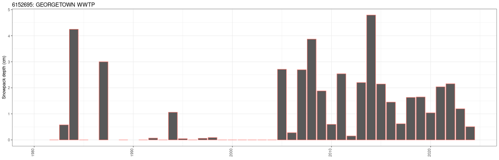

## Purpose

Input data to the Raven model is constrained to the availability of future climate projections. For instance, the [Ontario Climate Data Portal (OCDP)](https://lamps.math.yorku.ca/OntarioClimate/) offers daily ensemble data from 1981 to 2099 as precipitation and min/max/mean air temperature. For the sake of preparing the Raven model to accept these data, input data during calibration has to be kept the same.

Raven offers a number of methodologies to model snow melt. Once a partitioning scheme is selected, precipitation is separated into rainfall and snowfall. Snowfall then must enter a snowpack ablation scheme that will eventually convert snow on ground to snowmelt. 

Calibrating to snowmelt events cannot be made directly, in that it is rare (and non-existant in the Halton area) that stations monitor melt rates.  The closest information that is available is snowpack depth measurement offered at many stations including the ECCC-AES climate station [GEORGETOWN WWTP (6152695)](https://climate.weather.gc.ca/climate_data/daily_data_e.html?StationID=4923). 

GEORGETOWN WWTP has >20 years of snowdepth records, albeit the consistent records begin in the 2004-2005 winter season.

## Calibration

Of the many snowpack algorithms that exist with Raven, two processes are selected to model snowmelt in the Conservation Halton region:

1. `POTMELT_DEGREE_DAY`

    $$ M_\text{melt} = M_a\cdot\max(T_a-T_f,0) $$

1. `FREEZE_DEGREE_DAY`

    $$ M_\text{frz} = K_f\cdot\min(T_f-T_a,0) $$

Where $M_\text{melt}$ is the amount of melted snow, $M_\text{frz}$ is the amount of melted water that is held in snowpack pores and subsequently refreezes to the pack as the mean air temperatures $(T_a)$ drop, both factors have the dimensions of mm/day/$\degree\text{C}$. The parameters for these models are $M_a$ is the melt factor (raven parameter `MELT_FACTOR`), $K_f$ is the refreeze parameter (raven parameter `REFREEZE_FACTOR`), and $T_f$ is the freeze/melt temperature of water (`DD_MELT_TEMP`) kept constant at $0\degree\text{C}$.

These models are know as degree-day approaches and are widely used in snow-dominant areas. They are simple in that only 2 parameters are required to successfully model a complicated process. 

Applying a refreeze mechanism is also prudent in areas where temperature swings, above and below freezing, are common over short ($\lt$ day) timescales. Snow packs are a porous media.  Just like soils, snow has porosity; the only difference is that over extended periods of time, for a variety of reasons, porosity changes, a dynamic process know as snowpack metamorphism (DeWalle and Rango, 2008).

Like soil, all snowpacks have a liquid water holding capacity. As liquid water freezes, it releases latent heat which warms the snowpack. As liquid water freezes, it forms ice which increases the density of the frozen portion of the snowpack and reduces porosity. The density of the snowpack $(\rho_s)$ is the combination of solid (frozen) and liquid water:

$$ \rho_s = \rho_i(1-\phi) + \rho_w\phi S_w, $$

where $\rho_i$ and $\rho_w$ is the density of ice $(\approx 917\text{ km/m}^3)$ and water $(10^3\text{ km/m}^3)$, respectively, $\phi$ is the snowpack porosity and $S_w$ water saturation. Both $\phi$ and $S_w$ will vary in time, meaning that density changes with time.

By using the refreeze factor, Raven is implicitly simulating metamorphism.

### Rain-Snow partitioning

First, for consistency, direct snowfall and rainfall observations reported at the station is ignored. Rather, precipitation is taken in whole, and partitioned using Raven's linear approach. The parameters used are:

$$ \texttt{RAINSNOW\textunderscore TEMP}=-1.63^{\circ}\text{C} $$

$$ \texttt{RAINSNOW\textunderscore DELTA}=11.722^{\circ}\text{C} $$

### Model Calibration

In addition to the 2 model parameters (`MELT_FACTOR` and `REFREEZE_FACTOR`), an average snowpack density needs to be estimated to convert snowpack "snow-water equivalents" (which is what's returned by Raven) to snowpack depth:

$$ d = \frac{\rho_w}{\rho_s}\cdot\text{SWE} $$

This is not a Raven parameter, but it is required in order to calibrate Raven outputs to observation.

The model is automatically calibrated using the Dynamically Dimensioned Search (DDS) algorithm of Tolson and Shoemaker (2007). A total of 2000 model evaluations were made per trial and 10 trials were made. Parameters from the trial returning the highest Nash-Sutcliffe Efficiency (NSE) factor (Nash and Sutcliffe, 1970) was retained for the water-balance model.

The final calibrated snowmelt parameters are:

$$ \texttt{MELT\textunderscore FACTOR}=3.845\text{ mm}/\text{day}/\degree\text{C} $$

$$ \texttt{REFREEZE\textunderscore FACTOR}=0.0\text{ mm}/\text{day}/\degree\text{C} $$

1234567890
  > final      OF: 0.682973  [0.384 0.184 0.721]
MELT_FACTOR             3.844990
REFREEZE_FACTOR         0.000000
snowdensity             0.266399

## References

DeWalle, D.R. and A. Rango, 2008. Principles of Snow Hydrology. Cambridge University Press, Cambridge. 410pp.

Nash, J.E. and J.V. Sutcliffe, 1970.  River flow forecasting through conceptual models, Part I - A discussion of principles. Journal of Hydrology, 10. pp. 282-290.

Tolson B.A. and C.A. Shoemaker, 2007. Dynamically dimensioned search algorithm for computationally efficient watershed model calibration. Water Resources Research 43(1): 16pp.